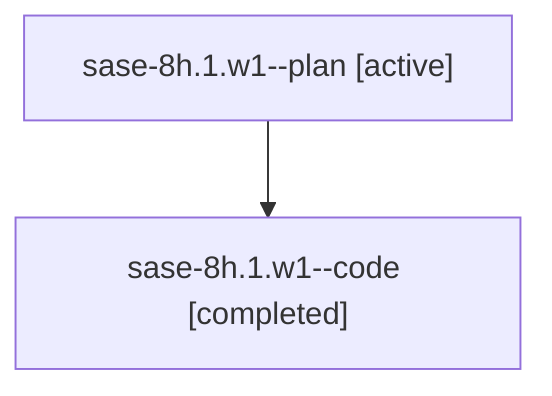

# Family: sase-8h.1.w1

[Agent Hoods](../README.md) / [bbugyi200](../users/bbugyi200/README.md) / [athena](../users/bbugyi200/machines/athena/README.md) / [sase-8h](../users/bbugyi200/machines/athena/hoods/sase-8h/README.md) / sase-8h.1.w1

Owner: `bbugyi200.athena` · Hood: `sase-8h` · Members: 2

## Lineage

The diagram is an optional enhancement; the ordered table below contains the same lineage in accessible text.

| Role | Agent | State | Model / provider | Timing | Commits | Prompt | Chat |
|---|---|---|---|---|---:|---|---|
| plan | sase-8h.1.w1--plan | active | claude-fable-5 / claude | 2026-07-21T14:39:20.532294+00:00 | 0 | [Prompt](../agents/bbugyi200.athena.sase-8h.1.w1--plan/prompt.md) | [Chat](../agents/bbugyi200.athena.sase-8h.1.w1--plan/chat.md) |
| code | sase-8h.1.w1--code | completed | gpt-5.6-sol / codex | 2026-07-21T14:53:56.930520+00:00 | [1](../agents/bbugyi200.athena.sase-8h.1.w1--code/README.md#commits) | — | [Chat](../agents/bbugyi200.athena.sase-8h.1.w1--code/chat.md) |

## Commits

| Role | Commit | Subject | Committed (UTC) |
|---|---|---|---|
| code | [`3e06256`](https://github.com/sase-org/sase/commit/3e06256aa6f65243bb424b91b8ed18ab865c5e11) | fix: preserve proposal associations from agent metadata | 2026-07-21 15:12:00 |

## Neighbors

| Agent | Relation | State |
|---|---|---|
| [sase-8h.1](../agents/bbugyi200.athena.sase-8h.1/README.md) | ancestor | completed |
| [sase-8h.2](bbugyi200.athena.sase-8h.2.md) (family · 2) | sase-8h hood | active 1, completed 1 |
| [sase-8h.2](../agents/bbugyi200.athena.sase-8h.2/README.md) | sase-8h hood | completed |
| [sase-8h.3](bbugyi200.athena.sase-8h.3.md) (family · 2) | sase-8h hood | active 1, completed 1 |
| [sase-8h.3](../agents/bbugyi200.athena.sase-8h.3/README.md) | sase-8h hood | completed |
| [sase-8h.land](../agents/bbugyi200.athena.sase-8h.land/README.md) | sase-8h hood | active |
