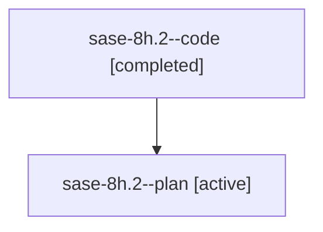

# Family: sase-8h.2

[Agent Hoods](../README.md) / [bbugyi200](../users/bbugyi200/README.md) / [athena](../users/bbugyi200/machines/athena/README.md) / [sase-8h](../users/bbugyi200/machines/athena/hoods/sase-8h/README.md) / sase-8h.2

Owner: `bbugyi200.athena` · Hood: `sase-8h` · Members: 2

## Lineage

The diagram is an optional enhancement; the ordered table below contains the same lineage in accessible text.

| Role | Agent | State | Model / provider | Timing | Commits | Prompt | Chat |
|---|---|---|---|---|---:|---|---|
| code | sase-8h.2--code | completed | gpt-5.6-sol / codex | 2026-07-21T14:43:06.098178+00:00 | [1](../agents/bbugyi200.athena.sase-8h.2--code/README.md#commits) | — | [Chat](../agents/bbugyi200.athena.sase-8h.2--code/chat.md) |
| plan | sase-8h.2--plan | active | gpt-5.6-sol / codex | 2026-07-21T14:39:28.554762+00:00 | 0 | [Prompt](../agents/bbugyi200.athena.sase-8h.2--plan/prompt.md) | [Chat](../agents/bbugyi200.athena.sase-8h.2--plan/chat.md) |

## Commits

| Role | Commit | Subject | Committed (UTC) |
|---|---|---|---|
| code | [`f9345e7`](https://github.com/sase-org/sase/commit/f9345e7c11bedb3b947dc2e17ae65d7b2e6d6d72) | fix(vcs): make commit collection truncation-aware (sase-8h.2) | 2026-07-21 15:18:31 |

## Neighbors

| Agent | Relation | State |
|---|---|---|
| [sase-8h.1](bbugyi200.athena.sase-8h.1.md) (family · 2) | sase-8h hood | active 1, completed 1 |
| [sase-8h.1](../agents/bbugyi200.athena.sase-8h.1/README.md) | sase-8h hood | completed |
| [sase-8h.1.w1](bbugyi200.athena.sase-8h.1.w1.md) (family · 2) | sase-8h hood | active 1, completed 1 |
| [sase-8h.1.w1](../agents/bbugyi200.athena.sase-8h.1.w1/README.md) | sase-8h hood | completed |
| [sase-8h.3](bbugyi200.athena.sase-8h.3.md) (family · 2) | sase-8h hood | active 1, completed 1 |
| [sase-8h.3](../agents/bbugyi200.athena.sase-8h.3/README.md) | sase-8h hood | completed |
| [sase-8h.land](../agents/bbugyi200.athena.sase-8h.land/README.md) | sase-8h hood | active |
