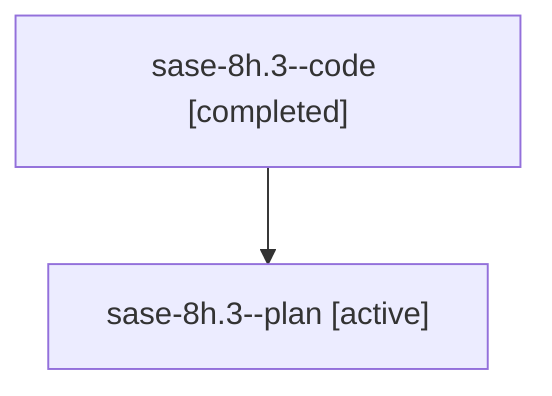

# Family: sase-8h.3

[Agent Hoods](../README.md) / [bbugyi200](../users/bbugyi200/README.md) / [athena](../users/bbugyi200/machines/athena/README.md) / [sase-8h](../users/bbugyi200/machines/athena/hoods/sase-8h/README.md) / sase-8h.3

Owner: `bbugyi200.athena` · Hood: `sase-8h` · Members: 2

## Lineage

The diagram is an optional enhancement; the ordered table below contains the same lineage in accessible text.

| Role | Agent | State | Model / provider | Timing | Commits | Prompt | Chat |
|---|---|---|---|---|---:|---|---|
| code | sase-8h.3--code | completed | gpt-5.6-sol / codex | 2026-07-21T15:23:13.831945+00:00 | 0 | — | [Chat](../agents/bbugyi200.athena.sase-8h.3--code/chat.md) |
| plan | sase-8h.3--plan | active | gpt-5.6-sol / codex | 2026-07-21T15:19:06.087194+00:00 | 0 | [Prompt](../agents/bbugyi200.athena.sase-8h.3--plan/prompt.md) | [Chat](../agents/bbugyi200.athena.sase-8h.3--plan/chat.md) |

## Commits

| Role | Repo | Commit | Subject | Committed |
|---|---|---|---|---|
| — | sase | [`54e8736`](https://github.com/sase-org/sase/commit/54e8736ea7ed487b3f600ad71939316764957b43) | fix(ace): report capped commit results truthfully (sase-8h.3) | 2026-07-21 12:17:45 EDT |

## Neighbors

| Agent | Relation | State |
|---|---|---|
| [sase-8h.1](bbugyi200.athena.sase-8h.1.md) (family · 2) | sase-8h hood | active 1, completed 1 |
| [sase-8h.1](../agents/bbugyi200.athena.sase-8h.1/README.md) | sase-8h hood | completed |
| [sase-8h.1.w1](bbugyi200.athena.sase-8h.1.w1.md) (family · 2) | sase-8h hood | active 1, completed 1 |
| [sase-8h.1.w1](../agents/bbugyi200.athena.sase-8h.1.w1/README.md) | sase-8h hood | completed |
| [sase-8h.2](bbugyi200.athena.sase-8h.2.md) (family · 2) | sase-8h hood | active 1, completed 1 |
| [sase-8h.2](../agents/bbugyi200.athena.sase-8h.2/README.md) | sase-8h hood | completed |
| [sase-8h.land](../agents/bbugyi200.athena.sase-8h.land/README.md) | sase-8h hood | active |
