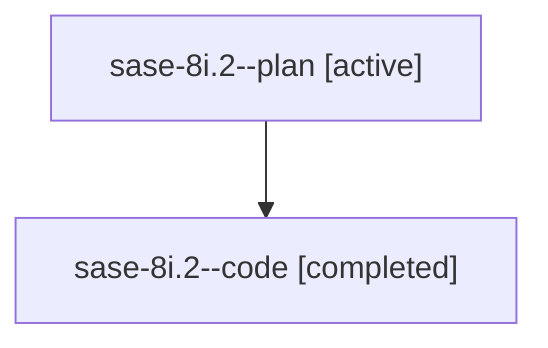

# Family: sase-8i.2

[Agent Hoods](../README.md) / [bbugyi200](../users/bbugyi200/README.md) / [athena](../users/bbugyi200/machines/athena/README.md) / [sase-8i](../users/bbugyi200/machines/athena/hoods/sase-8i/README.md) / sase-8i.2

Owner: `bbugyi200.athena` · Hood: `sase-8i` · Members: 2 · Bead: [sase-8i.2](https://github.com/sase-org/sase--beads/blob/main/pages/sase-8i/sase-8i.2.md)

## Lineage

The diagram is an optional enhancement; the ordered table below contains the same lineage in accessible text.

| Role | Agent | State | Model / provider | Timing | Commits | Prompt | Chat |
|---|---|---|---|---|---:|---|---|
| plan | sase-8i.2--plan | active | gpt-5.6-sol / codex | 2026-07-21T15:02:50.960307+00:00 | 0 | [Prompt](../agents/bbugyi200.athena.sase-8i.2--plan/prompt.md) | [Chat](../agents/bbugyi200.athena.sase-8i.2--plan/chat.md) |
| code | sase-8i.2--code | completed | gpt-5.6-sol / codex | 2026-07-21T15:06:13.571826+00:00 | [1](../agents/bbugyi200.athena.sase-8i.2--code/README.md#commits) | — | [Chat](../agents/bbugyi200.athena.sase-8i.2--code/chat.md) |

## Commits

| Role | Repo | Commit | Subject | Committed |
|---|---|---|---|---|
| code | sase | [`b825a0d`](https://github.com/sase-org/sase/commit/b825a0db49967ac243be2721eef722b5612c10a9) | fix: snapshot epic plans before clan launch (sase-8i.2) | 2026-07-21 11:38:14 EDT |

## Neighbors

| Agent | Relation | State |
|---|---|---|
| [sase-8i.1](../agents/bbugyi200.athena.sase-8i.1/README.md) | sase-8i hood | active |
| [sase-8i.3](bbugyi200.athena.sase-8i.3.md) (family · 2) | sase-8i hood | active 1, completed 1 |
| [sase-8i.land](../agents/bbugyi200.athena.sase-8i.land/README.md) | sase-8i hood | active |
