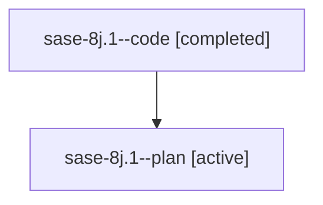

# Family: sase-8j.1

[Agent Hoods](../README.md) / [bbugyi200](../users/bbugyi200/README.md) / [athena](../users/bbugyi200/machines/athena/README.md) / [sase-8j](../users/bbugyi200/machines/athena/hoods/sase-8j/README.md) / sase-8j.1

Owner: `bbugyi200.athena` · Hood: `sase-8j` · Members: 2 · Bead: [sase-8j.1](https://github.com/sase-org/sase--beads/blob/main/pages/sase-8j/sase-8j.1.md)

## Lineage

The diagram is an optional enhancement; the ordered table below contains the same lineage in accessible text.

| Role | Agent | State | Model / provider | Timing | Commits | Prompt | Chat |
|---|---|---|---|---|---:|---|---|
| code | sase-8j.1--code | completed | gpt-5.6-sol / codex | 2026-07-21T20:36:48.864457+00:00 | 0 | — | [Chat](../agents/bbugyi200.athena.sase-8j.1--code/chat.md) |
| plan | sase-8j.1--plan | active | gpt-5.6-sol / codex | 2026-07-21T20:33:05.540090+00:00 | 0 | [Prompt](../agents/bbugyi200.athena.sase-8j.1--plan/prompt.md) | [Chat](../agents/bbugyi200.athena.sase-8j.1--plan/chat.md) |

## Neighbors

| Agent | Relation | State |
|---|---|---|
| [sase-8j.2](../agents/bbugyi200.athena.sase-8j.2/README.md) | sase-8j hood | active |
| [sase-8j.3](bbugyi200.athena.sase-8j.3.md) (family · 2) | sase-8j hood | active 1, completed 1 |
| [sase-8j.4](../agents/bbugyi200.athena.sase-8j.4/README.md) | sase-8j hood | active |
| [sase-8j.land](../agents/bbugyi200.athena.sase-8j.land/README.md) | sase-8j hood | active |
