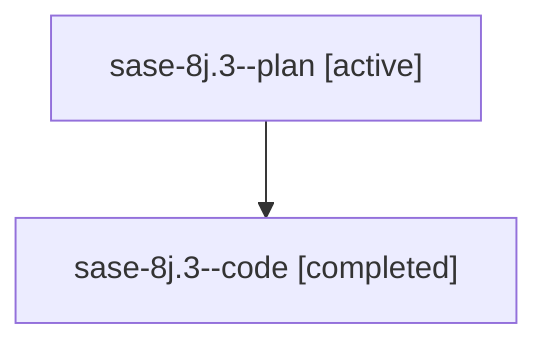

# Family: sase-8j.3

[Agent Hoods](../README.md) / [bbugyi200](../users/bbugyi200/README.md) / [athena](../users/bbugyi200/machines/athena/README.md) / [sase-8j](../users/bbugyi200/machines/athena/hoods/sase-8j/README.md) / sase-8j.3

Owner: `bbugyi200.athena` · Hood: `sase-8j` · Members: 2

## Lineage

The diagram is an optional enhancement; the ordered table below contains the same lineage in accessible text.

| Role | Agent | State | Model / provider | Timing | Commits | Prompt | Chat |
|---|---|---|---|---|---:|---|---|
| plan | sase-8j.3--plan | active | gpt-5.6-sol / codex | 2026-07-21T21:34:47.472705+00:00 | 0 | [Prompt](../agents/bbugyi200.athena.sase-8j.3--plan/prompt.md) | [Chat](../agents/bbugyi200.athena.sase-8j.3--plan/chat.md) |
| code | sase-8j.3--code | completed | gpt-5.6-sol / codex | 2026-07-21T21:38:27.173860+00:00 | [1](../agents/bbugyi200.athena.sase-8j.3--code/README.md#commits) | — | [Chat](../agents/bbugyi200.athena.sase-8j.3--code/chat.md) |

## Commits

| Role | Commit | Subject | Committed (UTC) |
|---|---|---|---|
| code | [`6c052e8`](https://github.com/sase-org/sase/commit/6c052e8169789a0b4ffa1fd536cf642c9a9bd88f) | feat(tui): add runner statistics experience (sase-8j.3) | 2026-07-21 22:07:24 |

## Neighbors

| Agent | Relation | State |
|---|---|---|
| [sase-8j.1](bbugyi200.athena.sase-8j.1.md) (family · 2) | sase-8j hood | active 1, completed 1 |
| [sase-8j.2](../agents/bbugyi200.athena.sase-8j.2/README.md) | sase-8j hood | active |
| [sase-8j.4](../agents/bbugyi200.athena.sase-8j.4/README.md) | sase-8j hood | active |
| [sase-8j.land](../agents/bbugyi200.athena.sase-8j.land/README.md) | sase-8j hood | active |
