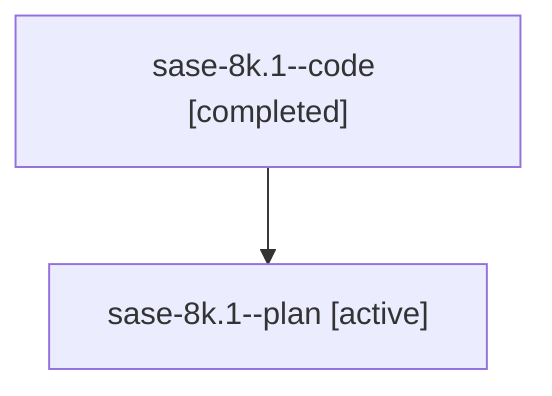

# Family: sase-8k.1

[Agent Hoods](../README.md) / [bbugyi200](../users/bbugyi200/README.md) / [athena](../users/bbugyi200/machines/athena/README.md) / [sase-8k](../users/bbugyi200/machines/athena/hoods/sase-8k/README.md) / sase-8k.1

Owner: `bbugyi200.athena` · Hood: `sase-8k` · Members: 2

## Lineage

The diagram is an optional enhancement; the ordered table below contains the same lineage in accessible text.

| Role | Agent | State | Model / provider | Timing | Commits | Prompt | Chat |
|---|---|---|---|---|---:|---|---|
| code | sase-8k.1--code | completed | gpt-5.6-sol / codex | 2026-07-22T14:59:27.957463+00:00 | [1](../agents/bbugyi200.athena.sase-8k.1--code/README.md#commits) | — | [Chat](../agents/bbugyi200.athena.sase-8k.1--code/chat.md) |
| plan | sase-8k.1--plan | active | gpt-5.6-sol / codex | 2026-07-22T14:54:34.817747+00:00 | 0 | [Prompt](../agents/bbugyi200.athena.sase-8k.1--plan/prompt.md) | [Chat](../agents/bbugyi200.athena.sase-8k.1--plan/chat.md) |

## Commits

| Role | Repo | Commit | Subject | Committed |
|---|---|---|---|---|
| code | sase | [`770ad01`](https://github.com/sase-org/sase/commit/770ad01ab111e5454d375ec786a1e60cb64c775d) | feat(config)!: add machine identity initialization (sase-8k.1) | 2026-07-22 11:51:28 EDT |

## Neighbors

| Agent | Relation | State |
|---|---|---|
| [sase-8k.2](../agents/bbugyi200.athena.sase-8k.2/README.md) | sase-8k hood | active |
| [sase-8k.3](bbugyi200.athena.sase-8k.3.md) (family · 2) | sase-8k hood | active 1, completed 1 |
| [sase-8k.3](../agents/bbugyi200.athena.sase-8k.3/README.md) | sase-8k hood | completed |
| [sase-8k.4](bbugyi200.athena.sase-8k.4.md) (family · 2) | sase-8k hood | active 1, completed 1 |
| [sase-8k.4](../agents/bbugyi200.athena.sase-8k.4/README.md) | sase-8k hood | completed |
| [sase-8k.5](bbugyi200.athena.sase-8k.5.md) (family · 2) | sase-8k hood | active 1, completed 1 |
| [sase-8k.5](../agents/bbugyi200.athena.sase-8k.5/README.md) | sase-8k hood | completed |
| [sase-8k.6](bbugyi200.athena.sase-8k.6.md) (family · 2) | sase-8k hood | active 1, completed 1 |
| [sase-8k.6](../agents/bbugyi200.athena.sase-8k.6/README.md) | sase-8k hood | completed |
| [sase-8k.7](bbugyi200.athena.sase-8k.7.md) (family · 2) | sase-8k hood | active 1, completed 1 |
| [sase-8k.7](../agents/bbugyi200.athena.sase-8k.7/README.md) | sase-8k hood | completed |
| [sase-8k.8](../agents/bbugyi200.athena.sase-8k.8/README.md) | sase-8k hood | active |
| [sase-8k.land](bbugyi200.athena.sase-8k.land.md) (family · 2) | sase-8k hood | active 1, completed 1 |
| [sase-8k.land](../agents/bbugyi200.athena.sase-8k.land/README.md) | sase-8k hood | completed |
