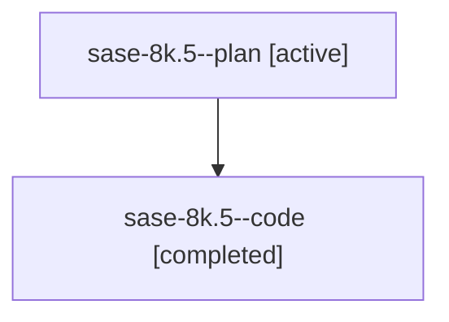

# Family: sase-8k.5

[Agent Hoods](../README.md) / [bbugyi200](../users/bbugyi200/README.md) / [athena](../users/bbugyi200/machines/athena/README.md) / [sase-8k](../users/bbugyi200/machines/athena/hoods/sase-8k/README.md) / sase-8k.5

Owner: `bbugyi200.athena` · Hood: `sase-8k` · Members: 2

## Lineage

The diagram is an optional enhancement; the ordered table below contains the same lineage in accessible text.

| Role | Agent | State | Model / provider | Timing | Commits | Prompt | Chat |
|---|---|---|---|---|---:|---|---|
| plan | sase-8k.5--plan | active | gpt-5.6-sol / codex | 2026-07-22T15:55:30.640462+00:00 | 0 | [Prompt](../agents/bbugyi200.athena.sase-8k.5--plan/prompt.md) | [Chat](../agents/bbugyi200.athena.sase-8k.5--plan/chat.md) |
| code | sase-8k.5--code | completed | gpt-5.6-sol / codex | 2026-07-22T15:58:28.947426+00:00 | [1](../agents/bbugyi200.athena.sase-8k.5--code/README.md#commits) | — | [Chat](../agents/bbugyi200.athena.sase-8k.5--code/chat.md) |

## Commits

| Role | Repo | Commit | Subject | Committed (UTC) |
|---|---|---|---|---|
| code | sase | [`44ccbe8`](https://github.com/sase-org/sase/commit/44ccbe84c7c23d1ad21433b428235dc37493072e) | feat(repo-init): initialize agents sidecars with explicit consent (sase-8k.5) | 2026-07-22 17:11:53 |

## Neighbors

| Agent | Relation | State |
|---|---|---|
| [sase-8k.1](bbugyi200.athena.sase-8k.1.md) (family · 2) | sase-8k hood | active 1, completed 1 |
| [sase-8k.1](../agents/bbugyi200.athena.sase-8k.1/README.md) | sase-8k hood | completed |
| [sase-8k.2](../agents/bbugyi200.athena.sase-8k.2/README.md) | sase-8k hood | active |
| [sase-8k.3](bbugyi200.athena.sase-8k.3.md) (family · 2) | sase-8k hood | active 1, completed 1 |
| [sase-8k.3](../agents/bbugyi200.athena.sase-8k.3/README.md) | sase-8k hood | completed |
| [sase-8k.4](bbugyi200.athena.sase-8k.4.md) (family · 2) | sase-8k hood | active 1, completed 1 |
| [sase-8k.4](../agents/bbugyi200.athena.sase-8k.4/README.md) | sase-8k hood | completed |
| [sase-8k.6](bbugyi200.athena.sase-8k.6.md) (family · 2) | sase-8k hood | active 1, completed 1 |
| [sase-8k.6](../agents/bbugyi200.athena.sase-8k.6/README.md) | sase-8k hood | completed |
| [sase-8k.7](bbugyi200.athena.sase-8k.7.md) (family · 2) | sase-8k hood | active 1, completed 1 |
| [sase-8k.7](../agents/bbugyi200.athena.sase-8k.7/README.md) | sase-8k hood | completed |
| [sase-8k.8](../agents/bbugyi200.athena.sase-8k.8/README.md) | sase-8k hood | active |
| [sase-8k.land](bbugyi200.athena.sase-8k.land.md) (family · 2) | sase-8k hood | active 1, completed 1 |
| [sase-8k.land](../agents/bbugyi200.athena.sase-8k.land/README.md) | sase-8k hood | completed |
