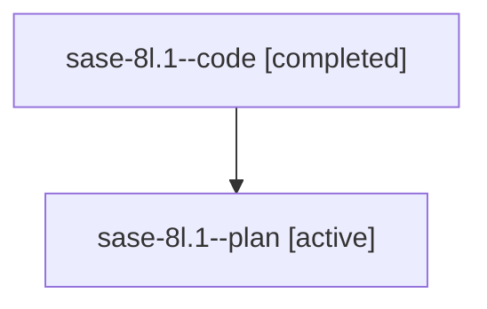

# Family: sase-8l.1

[Agent Hoods](../README.md) / [bbugyi200](../users/bbugyi200/README.md) / [athena](../users/bbugyi200/machines/athena/README.md) / [sase-8l](../users/bbugyi200/machines/athena/hoods/sase-8l/README.md) / sase-8l.1

Owner: `bbugyi200.athena` · Hood: `sase-8l` · Members: 2 · Bead: [sase-8l.1](https://github.com/sase-org/sase--beads/blob/main/pages/sase-8l/sase-8l.1.md)

## Lineage

The diagram is an optional enhancement; the ordered table below contains the same lineage in accessible text.

| Role | Agent | State | Model / provider | Timing | Commits | Prompt | Chat |
|---|---|---|---|---|---:|---|---|
| code | sase-8l.1--code | completed | gpt-5.6-sol / codex | 2026-07-22T16:04:40.052731+00:00 | [1](../agents/bbugyi200.athena.sase-8l.1--code/README.md#commits) | — | [Chat](../agents/bbugyi200.athena.sase-8l.1--code/chat.md) |
| plan | sase-8l.1--plan | active | gpt-5.6-sol / codex | 2026-07-22T15:58:58.016056+00:00 | 0 | [Prompt](../agents/bbugyi200.athena.sase-8l.1--plan/prompt.md) | [Chat](../agents/bbugyi200.athena.sase-8l.1--plan/chat.md) |

## Commits

| Role | Repo | Commit | Subject | Committed |
|---|---|---|---|---|
| code | sase | [`eaef2d7`](https://github.com/sase-org/sase/commit/eaef2d78b1faf15a0764e08b066383ee4d6a48e3) | feat(axe): carry clan summaries through chop launches (sase-8l.1) | 2026-07-22 12:42:07 EDT |

## Neighbors

| Agent | Relation | State |
|---|---|---|
| [sase-8l.2](bbugyi200.athena.sase-8l.2.md) (family · 2) | sase-8l hood | active 1, completed 1 |
| [sase-8l.land](../agents/bbugyi200.athena.sase-8l.land/README.md) | sase-8l hood | active |
