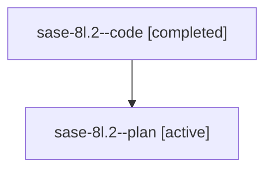

# Family: sase-8l.2

[Agent Hoods](../README.md) / [bbugyi200](../users/bbugyi200/README.md) / [athena](../users/bbugyi200/machines/athena/README.md) / [sase-8l](../users/bbugyi200/machines/athena/hoods/sase-8l/README.md) / sase-8l.2

Owner: `bbugyi200.athena` · Hood: `sase-8l` · Members: 2

## Lineage

The diagram is an optional enhancement; the ordered table below contains the same lineage in accessible text.

| Role | Agent | State | Model / provider | Timing | Commits | Prompt | Chat |
|---|---|---|---|---|---:|---|---|
| code | sase-8l.2--code | completed | gpt-5.6-sol / codex | 2026-07-22T16:57:19.719694+00:00 | 0 | — | [Chat](../agents/bbugyi200.athena.sase-8l.2--code/chat.md) |
| plan | sase-8l.2--plan | active | gpt-5.6-sol / codex | 2026-07-22T16:49:27.650624+00:00 | 0 | [Prompt](../agents/bbugyi200.athena.sase-8l.2--plan/prompt.md) | [Chat](../agents/bbugyi200.athena.sase-8l.2--plan/chat.md) |

## Neighbors

| Agent | Relation | State |
|---|---|---|
| [sase-8l.1](bbugyi200.athena.sase-8l.1.md) (family · 2) | sase-8l hood | active 1, completed 1 |
| [sase-8l.1](../agents/bbugyi200.athena.sase-8l.1/README.md) | sase-8l hood | completed |
| [sase-8l.land](../agents/bbugyi200.athena.sase-8l.land/README.md) | sase-8l hood | active |
