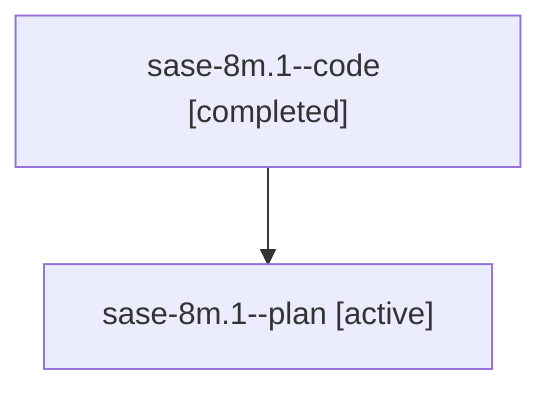

# Family: sase-8m.1

[Agent Hoods](../README.md) / [bbugyi200](../users/bbugyi200/README.md) / [athena](../users/bbugyi200/machines/athena/README.md) / [sase-8m](../users/bbugyi200/machines/athena/hoods/sase-8m/README.md) / sase-8m.1

Owner: `bbugyi200.athena` · Hood: `sase-8m` · Members: 2

## Lineage

The diagram is an optional enhancement; the ordered table below contains the same lineage in accessible text.

| Role | Agent | State | Model / provider | Timing | Commits | Prompt | Chat |
|---|---|---|---|---|---:|---|---|
| code | sase-8m.1--code | completed | gpt-5.6-sol / codex | 2026-07-22T16:04:58.063261+00:00 | [1](../agents/bbugyi200.athena.sase-8m.1--code/README.md#commits) | — | [Chat](../agents/bbugyi200.athena.sase-8m.1--code/chat.md) |
| plan | sase-8m.1--plan | active | gpt-5.6-sol / codex | 2026-07-22T15:59:52.644143+00:00 | 0 | [Prompt](../agents/bbugyi200.athena.sase-8m.1--plan/prompt.md) | [Chat](../agents/bbugyi200.athena.sase-8m.1--plan/chat.md) |

## Commits

| Role | Commit | Subject | Committed (UTC) |
|---|---|---|---|
| code | [`5a9cef8`](https://github.com/sase-org/sase/commit/5a9cef88329bc5f3323603300bc86040509530a0) | feat(axe): apply exact conflict-safe config edits (sase-8m.1) | 2026-07-22 17:23:39 |

## Neighbors

| Agent | Relation | State |
|---|---|---|
| [sase-8m.2](bbugyi200.athena.sase-8m.2.md) (family · 2) | sase-8m hood | active 2 |
| [sase-8m.2](../agents/bbugyi200.athena.sase-8m.2/README.md) | sase-8m hood | completed |
| [sase-8m.3](bbugyi200.athena.sase-8m.3.md) (family · 2) | sase-8m hood | active 1, completed 1 |
| [sase-8m.3](../agents/bbugyi200.athena.sase-8m.3/README.md) | sase-8m hood | completed |
| [sase-8m.4](../agents/bbugyi200.athena.sase-8m.4/README.md) | sase-8m hood | active |
| [sase-8m.land](../agents/bbugyi200.athena.sase-8m.land/README.md) | sase-8m hood | active |
