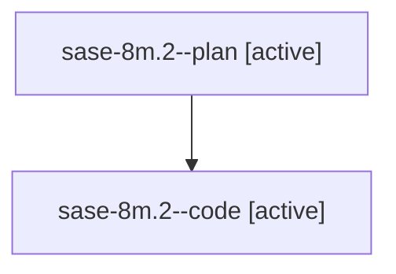

# Family: sase-8m.2

[Agent Hoods](../README.md) / [bbugyi200](../users/bbugyi200/README.md) / [athena](../users/bbugyi200/machines/athena/README.md) / [sase-8m](../users/bbugyi200/machines/athena/hoods/sase-8m/README.md) / sase-8m.2

Owner: `bbugyi200.athena` · Hood: `sase-8m` · Members: 2 · Bead: [sase-8m.2](https://github.com/sase-org/sase--beads/blob/main/pages/sase-8m/sase-8m.2.md)

## Lineage

The diagram is an optional enhancement; the ordered table below contains the same lineage in accessible text.

| Role | Agent | State | Model / provider | Timing | Commits | Prompt | Chat |
|---|---|---|---|---|---:|---|---|
| plan | sase-8m.2--plan | active | gpt-5.6-sol / codex | 2026-07-22T15:59:56.290410+00:00 | 0 | [Prompt](../agents/bbugyi200.athena.sase-8m.2--plan/prompt.md) | [Chat](../agents/bbugyi200.athena.sase-8m.2--plan/chat.md) |
| code | sase-8m.2--code | active | gpt-5.6-sol / codex | 2026-07-22T16:04:10.658199+00:00 | [1](../agents/bbugyi200.athena.sase-8m.2--code/README.md#commits) | — | — |

## Commits

| Role | Repo | Commit | Subject | Committed |
|---|---|---|---|---|
| code | sase | [`331932b`](https://github.com/sase-org/sase/commit/331932b2c8c82517dd5920b5129822e50466079d) | feat(ace): add shared config editor components (sase-8m.2) | 2026-07-22 13:19:57 EDT |

## Neighbors

| Agent | Relation | State |
|---|---|---|
| [sase-8m.1](bbugyi200.athena.sase-8m.1.md) (family · 2) | sase-8m hood | active 1, completed 1 |
| [sase-8m.3](bbugyi200.athena.sase-8m.3.md) (family · 2) | sase-8m hood | active 1, completed 1 |
| [sase-8m.4](../agents/bbugyi200.athena.sase-8m.4/README.md) | sase-8m hood | active |
| [sase-8m.land](../agents/bbugyi200.athena.sase-8m.land/README.md) | sase-8m hood | active |
