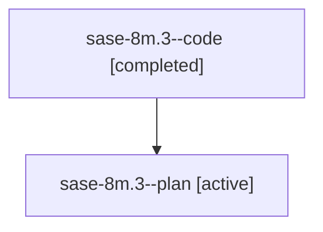

# Family: sase-8m.3

[Agent Hoods](../README.md) / [bbugyi200](../users/bbugyi200/README.md) / [athena](../users/bbugyi200/machines/athena/README.md) / [sase-8m](../users/bbugyi200/machines/athena/hoods/sase-8m/README.md) / sase-8m.3

Owner: `bbugyi200.athena` · Hood: `sase-8m` · Members: 2

## Lineage

The diagram is an optional enhancement; the ordered table below contains the same lineage in accessible text.

| Role | Agent | State | Model / provider | Timing | Commits | Prompt | Chat |
|---|---|---|---|---|---:|---|---|
| code | sase-8m.3--code | completed | gpt-5.6-sol / codex | 2026-07-22T18:00:26.813512+00:00 | [1](../agents/bbugyi200.athena.sase-8m.3--code/README.md#commits) | — | [Chat](../agents/bbugyi200.athena.sase-8m.3--code/chat.md) |
| plan | sase-8m.3--plan | active | gpt-5.6-sol / codex | 2026-07-22T17:52:34.105679+00:00 | 0 | [Prompt](../agents/bbugyi200.athena.sase-8m.3--plan/prompt.md) | [Chat](../agents/bbugyi200.athena.sase-8m.3--plan/chat.md) |

## Commits

| Role | Repo | Commit | Subject | Committed (UTC) |
|---|---|---|---|---|
| code | sase | [`058cd64`](https://github.com/sase-org/sase/commit/058cd646fb1d3113fe28186473f252dc4f488d13) | feat(axe): add config management workflows (sase-8m.3) | 2026-07-22 18:39:16 |

## Neighbors

| Agent | Relation | State |
|---|---|---|
| [sase-8m.1](bbugyi200.athena.sase-8m.1.md) (family · 2) | sase-8m hood | active 1, completed 1 |
| [sase-8m.1](../agents/bbugyi200.athena.sase-8m.1/README.md) | sase-8m hood | completed |
| [sase-8m.2](bbugyi200.athena.sase-8m.2.md) (family · 2) | sase-8m hood | active 2 |
| [sase-8m.2](../agents/bbugyi200.athena.sase-8m.2/README.md) | sase-8m hood | completed |
| [sase-8m.4](../agents/bbugyi200.athena.sase-8m.4/README.md) | sase-8m hood | active |
| [sase-8m.land](../agents/bbugyi200.athena.sase-8m.land/README.md) | sase-8m hood | active |
