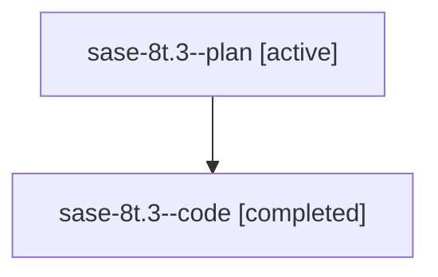

# Family: sase-8t.3

[Agent Hoods](../README.md) / [bbugyi200](../users/bbugyi200/README.md) / [athena](../users/bbugyi200/machines/athena/README.md) / [sase-8t](../users/bbugyi200/machines/athena/hoods/sase-8t/README.md) / sase-8t.3

Owner: `bbugyi200.athena` · Hood: `sase-8t` · Members: 2 · Bead: [sase-8t.3](https://github.com/sase-org/sase--beads/blob/main/pages/sase-8t/sase-8t.3.md)

## Lineage

The diagram is an optional enhancement; the ordered table below contains the same lineage in accessible text.

| Role | Agent | State | Model / provider | Timing | Commits | Prompt | Chat |
|---|---|---|---|---|---:|---|---|
| plan | sase-8t.3--plan | active | gpt-5.6-sol / codex | 2026-07-23T12:39:08.179462+00:00 | 0 | [Prompt](../agents/bbugyi200.athena.sase-8t.3--plan/prompt.md) | [Chat](../agents/bbugyi200.athena.sase-8t.3--plan/chat.md) |
| code | sase-8t.3--code | completed | gpt-5.6-sol / codex | 2026-07-23T12:43:13.774757+00:00 | [1](../agents/bbugyi200.athena.sase-8t.3--code/README.md#commits) | — | [Chat](../agents/bbugyi200.athena.sase-8t.3--code/chat.md) |

## Commits

| Role | Repo | Commit | Subject | Committed |
|---|---|---|---|---|
| code | sase | [`d0cf97a`](https://github.com/sase-org/sase/commit/d0cf97a12930b4c28e0f86097518cf05965ca306) | feat(axe): add whole-system status command (sase-8t.3) | 2026-07-23 09:05:49 EDT |

## Neighbors

| Agent | Relation | State |
|---|---|---|
| [sase-8t.1](bbugyi200.athena.sase-8t.1.md) (family · 1) | sase-8t hood | active 1 |
| [sase-8t.2](bbugyi200.athena.sase-8t.2.md) (family · 2) | sase-8t hood | active 1, completed 1 |
| [sase-8t.2](../agents/bbugyi200.athena.sase-8t.2/README.md) | sase-8t hood | completed |
| [sase-8t.land](../agents/bbugyi200.athena.sase-8t.land/README.md) | sase-8t hood | active |
