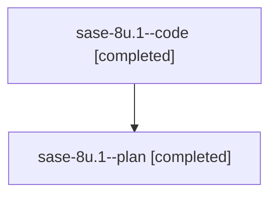

# Family: sase-8u.1

Owner: `bbugyi200.athena` · Hood: `sase-8u` · Members: 2

## Lineage

The diagram is an optional enhancement; the ordered table below contains the same lineage in accessible text.

| Role | Agent | State | Model / provider | Timing | Commits | Prompt | Chat |
|---|---|---|---|---|---:|---|---|
| code | sase-8u.1--code | completed | gpt-5.6-sol / codex | 2026-07-23T12:15:40.538159+00:00 | 0 | — | [Chat](../agents/bbugyi200.athena.sase-8u.1--code/chat.md) |
| plan | sase-8u.1--plan | completed | gpt-5.6-sol / codex | 2026-07-23T12:12:55.805725+00:00 | 0 | [Prompt](../agents/bbugyi200.athena.sase-8u.1--plan/prompt.md) | [Chat](../agents/bbugyi200.athena.sase-8u.1--plan/chat.md) |
