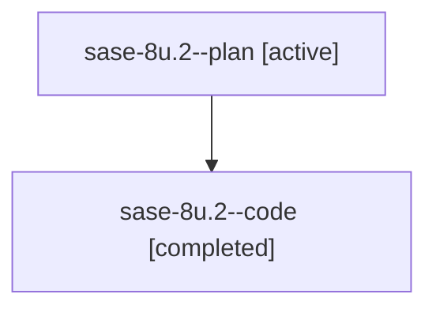

# Family: sase-8u.2

[Agent Hoods](../README.md) / [bbugyi200](../users/bbugyi200/README.md) / [athena](../users/bbugyi200/machines/athena/README.md) / [sase-8u](../users/bbugyi200/machines/athena/hoods/sase-8u/README.md) / sase-8u.2

Owner: `bbugyi200.athena` · Hood: `sase-8u` · Members: 2 · Bead: [sase-8u.2](https://github.com/sase-org/sase--beads/blob/main/pages/sase-8u/sase-8u.2.md)

## Lineage

The diagram is an optional enhancement; the ordered table below contains the same lineage in accessible text.

| Role | Agent | State | Model / provider | Timing | Commits | Prompt | Chat |
|---|---|---|---|---|---:|---|---|
| plan | sase-8u.2--plan | active | gpt-5.6-sol / codex | 2026-07-23T12:28:06.464330+00:00 | 0 | [Prompt](../agents/bbugyi200.athena.sase-8u.2--plan/prompt.md) | [Chat](../agents/bbugyi200.athena.sase-8u.2--plan/chat.md) |
| code | sase-8u.2--code | completed | gpt-5.6-sol / codex | 2026-07-23T12:33:42.311344+00:00 | [1](../agents/bbugyi200.athena.sase-8u.2--code/README.md#commits) | — | [Chat](../agents/bbugyi200.athena.sase-8u.2--code/chat.md) |

## Commits

| Role | Repo | Commit | Subject | Committed |
|---|---|---|---|---|
| code | sase | [`6e6b8d8`](https://github.com/sase-org/sase/commit/6e6b8d85c3c4314d84ba5167c22a955bacf623fe) | feat: integrate core capitalized snippet aliases (sase-8u.2) | 2026-07-23 09:04:22 EDT |

## Neighbors

| Agent | Relation | State |
|---|---|---|
| [sase-8u.1](bbugyi200.athena.sase-8u.1.md) (family · 2) | sase-8u hood | active 1, completed 1 |
| [sase-8u.3](../agents/bbugyi200.athena.sase-8u.3/README.md) | sase-8u hood | active |
| [sase-8u.4.1](bbugyi200.athena.sase-8u.4.1.md) (family · 2) | sase-8u hood | active 1, completed 1 |
| [sase-8u.land](../agents/bbugyi200.athena.sase-8u.land/README.md) | sase-8u hood | active |
