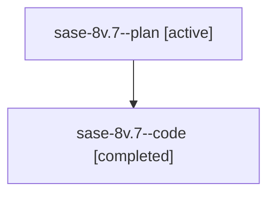

# Family: sase-8v.7

[Agent Hoods](../README.md) / [bbugyi200](../users/bbugyi200/README.md) / [athena](../users/bbugyi200/machines/athena/README.md) / [sase-8v](../users/bbugyi200/machines/athena/hoods/sase-8v/README.md) / sase-8v.7

Owner: `bbugyi200.athena` · Hood: `sase-8v` · Members: 2 · Bead: [sase-8v.7](https://github.com/sase-org/sase--beads/blob/main/pages/sase-8v/sase-8v.7.md)

## Lineage

The diagram is an optional enhancement; the ordered table below contains the same lineage in accessible text.

| Role | Agent | State | Model / provider | Timing | Commits | Prompt | Chat |
|---|---|---|---|---|---:|---|---|
| plan | sase-8v.7--plan | active | gpt-5.6-sol / codex | 2026-07-24T19:55:33.348546+00:00 | 0 | [Prompt](../agents/bbugyi200.athena.sase-8v.7--plan/prompt.md) | [Chat](../agents/bbugyi200.athena.sase-8v.7--plan/chat.md) |
| code | sase-8v.7--code | completed | gpt-5.6-sol / codex | 2026-07-24T20:01:39.470107+00:00 | [1](../agents/bbugyi200.athena.sase-8v.7--code/README.md#commits) | — | [Chat](../agents/bbugyi200.athena.sase-8v.7--code/chat.md) |

## Commits

| Role | Repo | Commit | Subject | Committed |
|---|---|---|---|---|
| code | sase | [`f76a9ed`](https://github.com/sase-org/sase/commit/f76a9ede7738308fc89ca7cfe6f476e0a6598727) | feat: cache foreign agent state for offline integration (sase-8v.7) | 2026-07-24 17:07:49 EDT |

## Neighbors

| Agent | Relation | State |
|---|---|---|
| [sase-8v.1](bbugyi200.athena.sase-8v.1.md) (family · 2) | sase-8v hood | active 1, completed 1 |
| [sase-8v.1](../agents/bbugyi200.athena.sase-8v.1/README.md) | sase-8v hood | completed |
| [sase-8v.10](../agents/bbugyi200.athena.sase-8v.10/README.md) | sase-8v hood | active |
| [sase-8v.2](bbugyi200.athena.sase-8v.2.md) (family · 2) | sase-8v hood | active 1, completed 1 |
| [sase-8v.2](../agents/bbugyi200.athena.sase-8v.2/README.md) | sase-8v hood | completed |
| [sase-8v.3](bbugyi200.athena.sase-8v.3.md) (family · 2) | sase-8v hood | active 1, completed 1 |
| [sase-8v.3](../agents/bbugyi200.athena.sase-8v.3/README.md) | sase-8v hood | completed |
| [sase-8v.4](bbugyi200.athena.sase-8v.4.md) (family · 2) | sase-8v hood | active 1, completed 1 |
| [sase-8v.5](bbugyi200.athena.sase-8v.5.md) (family · 2) | sase-8v hood | active 1, completed 1 |
| [sase-8v.5](../agents/bbugyi200.athena.sase-8v.5/README.md) | sase-8v hood | completed |
| [sase-8v.6](../agents/bbugyi200.athena.sase-8v.6/README.md) | sase-8v hood | active |
| [sase-8v.8](../agents/bbugyi200.athena.sase-8v.8/README.md) | sase-8v hood | active |
| [sase-8v.9](../agents/bbugyi200.athena.sase-8v.9/README.md) | sase-8v hood | active |
| [sase-8v.land](../agents/bbugyi200.athena.sase-8v.land/README.md) | sase-8v hood | active |
| [sase-8v.land.f0](../agents/bbugyi200.athena.sase-8v.land.f0/README.md) | sase-8v hood | active |
| [sase-8v.land.f1](../agents/bbugyi200.athena.sase-8v.land.f1/README.md) | sase-8v hood | active |
| [sase-8v.land.f2](../agents/bbugyi200.athena.sase-8v.land.f2/README.md) | sase-8v hood | waiting |
| [sase-8v.land.f3](../agents/bbugyi200.athena.sase-8v.land.f3/README.md) | sase-8v hood | waiting |
| [sase-8v.land.w0](../agents/bbugyi200.athena.sase-8v.land.w0/README.md) | sase-8v hood | active |
| [sase-8v.land.w2](../agents/bbugyi200.athena.sase-8v.land.w2/README.md) | sase-8v hood | active |
