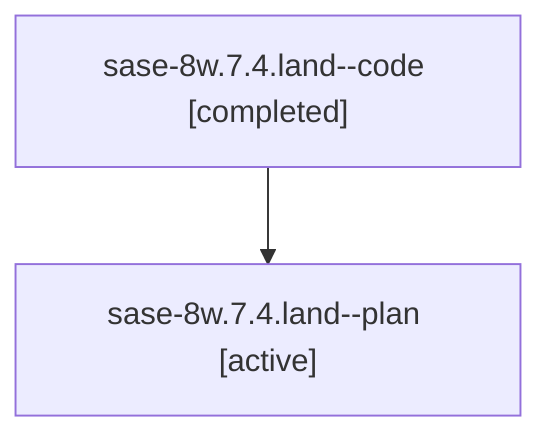

# Family: sase-8w.7.4.land

[Agent Hoods](../README.md) / [bbugyi200](../users/bbugyi200/README.md) / [athena](../users/bbugyi200/machines/athena/README.md) / [sase-8w](../users/bbugyi200/machines/athena/hoods/sase-8w/README.md) / sase-8w.7.4.land

Owner: `bbugyi200.athena` · Hood: `sase-8w` · Members: 2 · Bead: [sase-8w.7.4](https://github.com/sase-org/sase--beads/blob/main/pages/sase-8w/sase-8w.7.4.md)

## Lineage

The diagram is an optional enhancement; the ordered table below contains the same lineage in accessible text.

| Role | Agent | State | Model / provider | Timing | Commits | Prompt | Chat |
|---|---|---|---|---|---:|---|---|
| code | sase-8w.7.4.land--code | completed | gpt-5.6-sol / codex | 2026-07-24T01:20:10.077310+00:00 | 0 | — | [Chat](../agents/bbugyi200.athena.sase-8w.7.4.land--code/chat.md) |
| plan | sase-8w.7.4.land--plan | active | gpt-5.6-sol / codex | 2026-07-24T01:07:30.120475+00:00 | 0 | [Prompt](../agents/bbugyi200.athena.sase-8w.7.4.land--plan/prompt.md) | [Chat](../agents/bbugyi200.athena.sase-8w.7.4.land--plan/chat.md) |

## Neighbors

| Agent | Relation | State |
|---|---|---|
| [sase-8w.7.4.1](../agents/bbugyi200.athena.sase-8w.7.4.1/README.md) | sase-8w.7.4 hood | active |
| [sase-8w.7.4.2](../agents/bbugyi200.athena.sase-8w.7.4.2/README.md) | sase-8w.7.4 hood | active |
| [sase-8w.7.1](../agents/bbugyi200.athena.sase-8w.7.1/README.md) | sase-8w.7 hood | active |
| [sase-8w.7.2](../agents/bbugyi200.athena.sase-8w.7.2/README.md) | sase-8w.7 hood | active |
| [sase-8w.7.3](../agents/bbugyi200.athena.sase-8w.7.3/README.md) | sase-8w.7 hood | active |
| [sase-8w.7.land](../agents/bbugyi200.athena.sase-8w.7.land/README.md) | sase-8w.7 hood | active |
| [sase-8w.1](../agents/bbugyi200.athena.sase-8w.1/README.md) | sase-8w hood | active |
| [sase-8w.2](../agents/bbugyi200.athena.sase-8w.2/README.md) | sase-8w hood | active |
| [sase-8w.3](../agents/bbugyi200.athena.sase-8w.3/README.md) | sase-8w hood | active |
| [sase-8w.4](../agents/bbugyi200.athena.sase-8w.4/README.md) | sase-8w hood | active |
| [sase-8w.5](../agents/bbugyi200.athena.sase-8w.5/README.md) | sase-8w hood | active |
| [sase-8w.6](../agents/bbugyi200.athena.sase-8w.6/README.md) | sase-8w hood | active |
| [sase-8w.land](../agents/bbugyi200.athena.sase-8w.land/README.md) | sase-8w hood | active |
