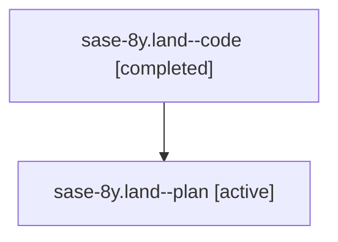

# Family: sase-8y.land

[Agent Hoods](../README.md) / [bbugyi200](../users/bbugyi200/README.md) / [athena](../users/bbugyi200/machines/athena/README.md) / [sase-8y](../users/bbugyi200/machines/athena/hoods/sase-8y/README.md) / sase-8y.land

Owner: `bbugyi200.athena` · Hood: `sase-8y` · Members: 2 · Bead: [sase-8y](https://github.com/sase-org/sase--beads/blob/main/pages/sase-8y/README.md)

## Lineage

The diagram is an optional enhancement; the ordered table below contains the same lineage in accessible text.

| Role | Agent | State | Model / provider | Timing | Commits | Prompt | Chat |
|---|---|---|---|---|---:|---|---|
| code | sase-8y.land--code | completed | gpt-5.6-sol / codex | 2026-07-24T22:13:13.829161+00:00 | [1](../agents/bbugyi200.athena.sase-8y.land--code/README.md#commits) | — | [Chat](../agents/bbugyi200.athena.sase-8y.land--code/chat.md) |
| plan | sase-8y.land--plan | active | gpt-5.6-sol / codex | 2026-07-24T22:07:00.207735+00:00 | 0 | [Prompt](../agents/bbugyi200.athena.sase-8y.land--plan/prompt.md) | [Chat](../agents/bbugyi200.athena.sase-8y.land--plan/chat.md) |

## Commits

| Role | Repo | Commit | Subject | Committed |
|---|---|---|---|---|
| code | sase | [`d0495f1`](https://github.com/sase-org/sase/commit/d0495f1cba07b4706cc7696a1561d9fa0a0c3343) | fix: finish claimed status landing cleanup (sase-8y) | 2026-07-24 22:58:11 UTC |

## Neighbors

| Agent | Relation | State |
|---|---|---|
| [sase-8y.1](../agents/bbugyi200.athena.sase-8y.1/README.md) | sase-8y hood | active |
| [sase-8y.2](../agents/bbugyi200.athena.sase-8y.2/README.md) | sase-8y hood | active |
| [sase-8y.3](../agents/bbugyi200.athena.sase-8y.3/README.md) | sase-8y hood | active |
| [sase-8y.4](../agents/bbugyi200.athena.sase-8y.4/README.md) | sase-8y hood | active |
| [sase-8y.5](../agents/bbugyi200.athena.sase-8y.5/README.md) | sase-8y hood | active |
| [sase-8y.6](../agents/bbugyi200.athena.sase-8y.6/README.md) | sase-8y hood | active |
| [sase-8y.7](../agents/bbugyi200.athena.sase-8y.7/README.md) | sase-8y hood | active |
