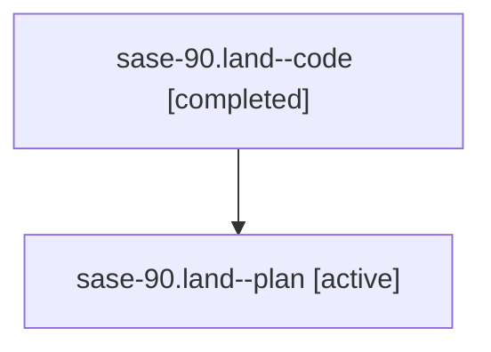

# Family: sase-90.land

[Agent Hoods](../README.md) / [bbugyi200](../users/bbugyi200/README.md) / [athena](../users/bbugyi200/machines/athena/README.md) / [sase-90](../users/bbugyi200/machines/athena/hoods/sase-90/README.md) / sase-90.land

Owner: `bbugyi200.athena` · Hood: `sase-90` · Members: 2 · Bead: [sase-90](https://github.com/sase-org/sase--beads/blob/main/pages/sase-90/README.md)

## Lineage

The diagram is an optional enhancement; the ordered table below contains the same lineage in accessible text.

| Role | Agent | State | Model / provider | Timing | Commits | Prompt | Chat |
|---|---|---|---|---|---:|---|---|
| code | sase-90.land--code | completed | gpt-5.6-sol / codex | 2026-07-25T01:52:41.813693+00:00 | [1](../agents/bbugyi200.athena.sase-90.land--code/README.md#commits) | — | [Chat](../agents/bbugyi200.athena.sase-90.land--code/chat.md) |
| plan | sase-90.land--plan | active | gpt-5.6-sol / codex | 2026-07-25T01:42:20.331655+00:00 | 0 | [Prompt](../agents/bbugyi200.athena.sase-90.land--plan/prompt.md) | [Chat](../agents/bbugyi200.athena.sase-90.land--plan/chat.md) |

## Commits

| Role | Repo | Commit | Subject | Committed |
|---|---|---|---|---|
| code | sase | [`e5d953e`](https://github.com/sase-org/sase/commit/e5d953eadd0b66ce4c9d8806d045048943107825) | feat(chats): expose publication quarantine provenance (sase-90) | 2026-07-25 02:12:39 UTC |

## Neighbors

| Agent | Relation | State |
|---|---|---|
| [sase-90.1](../agents/bbugyi200.athena.sase-90.1/README.md) | sase-90 hood | active |
| [sase-90.2](../agents/bbugyi200.athena.sase-90.2/README.md) | sase-90 hood | active |
| [sase-90.3](../agents/bbugyi200.athena.sase-90.3/README.md) | sase-90 hood | active |
| [sase-90.4](../agents/bbugyi200.athena.sase-90.4/README.md) | sase-90 hood | active |
| [sase-90.5](../agents/bbugyi200.athena.sase-90.5/README.md) | sase-90 hood | active |
| [sase-90.6](../agents/bbugyi200.athena.sase-90.6/README.md) | sase-90 hood | active |
| [sase-90.7](../agents/bbugyi200.athena.sase-90.7/README.md) | sase-90 hood | active |
| [sase-90.8](../agents/bbugyi200.athena.sase-90.8/README.md) | sase-90 hood | active |
