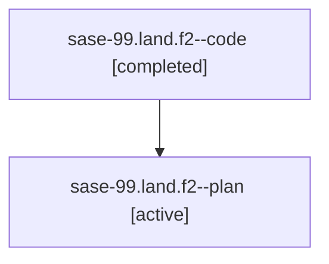

# Family: sase-99.land.f2

[Agent Hoods](../README.md) / [bbugyi200](../users/bbugyi200/README.md) / [athena](../users/bbugyi200/machines/athena/README.md) / [sase-99](../users/bbugyi200/machines/athena/hoods/sase-99/README.md) / sase-99.land.f2

Owner: `bbugyi200.athena` · Hood: `sase-99` · Members: 2

## Lineage

The diagram is an optional enhancement; the ordered table below contains the same lineage in accessible text.

| Role | Agent | State | Model / provider | Timing | Commits | Prompt | Chat |
|---|---|---|---|---|---:|---|---|
| code | sase-99.land.f2--code | completed | opus / claude | 2026-07-25T17:43:05.611550+00:00 | 0 | — | [Chat](../agents/bbugyi200.athena.sase-99.land.f2--code/chat.md) |
| plan | sase-99.land.f2--plan | active | opus / claude | 2026-07-25T17:26:15.334449+00:00 | 0 | [Prompt](../agents/bbugyi200.athena.sase-99.land.f2--plan/prompt.md) | [Chat](../agents/bbugyi200.athena.sase-99.land.f2--plan/chat.md) |

## Neighbors

| Agent | Relation | State |
|---|---|---|
| [sase-99.land](../agents/bbugyi200.athena.sase-99.land/README.md) | ancestor | active |
| [sase-99.land.f3](bbugyi200.athena.sase-99.land.f3.md) (family · 2) | sase-99.land hood | active 1, completed 1 |
| [sase-99.land.f3](../agents/bbugyi200.athena.sase-99.land.f3/README.md) | sase-99.land hood | completed |
| [sase-99.1](../agents/bbugyi200.athena.sase-99.1/README.md) | sase-99 hood | active |
| [sase-99.2](../agents/bbugyi200.athena.sase-99.2/README.md) | sase-99 hood | active |
| [sase-99.3](../agents/bbugyi200.athena.sase-99.3/README.md) | sase-99 hood | active |
| [sase-99.4](../agents/bbugyi200.athena.sase-99.4/README.md) | sase-99 hood | active |
| [sase-99.5](../agents/bbugyi200.athena.sase-99.5/README.md) | sase-99 hood | active |
