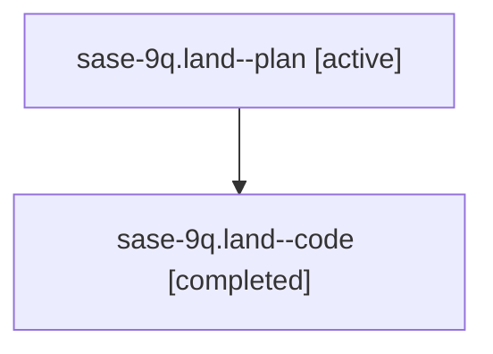

# Family: sase-9q.land

[Agent Hoods](../README.md) / [bbugyi200](../users/bbugyi200/README.md) / [athena](../users/bbugyi200/machines/athena/README.md) / [sase-9q](../users/bbugyi200/machines/athena/hoods/sase-9q/README.md) / sase-9q.land

Owner: `bbugyi200.athena` · Hood: `sase-9q` · Members: 2

## Lineage

The diagram is an optional enhancement; the ordered table below contains the same lineage in accessible text.

| Role | Agent | State | Model / provider | Timing | Commits | Prompt | Chat |
|---|---|---|---|---|---:|---|---|
| plan | sase-9q.land--plan | active | claude-fable-5 / claude | 2026-07-26T15:21:34.050453+00:00 | 0 | [Prompt](../agents/bbugyi200.athena.sase-9q.land--plan/prompt.md) | [Chat](../agents/bbugyi200.athena.sase-9q.land--plan/chat.md) |
| code | sase-9q.land--code | completed | gpt-5.6-sol / codex | 2026-07-26T15:29:46.102640+00:00 | [1](../agents/bbugyi200.athena.sase-9q.land--code/README.md#commits) | — | [Chat](../agents/bbugyi200.athena.sase-9q.land--code/chat.md) |

## Commits

| Role | Repo | Commit | Subject | Committed |
|---|---|---|---|---|
| code | sase | [`f5f30f9`](https://github.com/sase-org/sase/commit/f5f30f91e6f5c76b02d58b371d64761910448e39) | feat(ace): honor xprompt placeholder argument toggle (sase-9q) | 2026-07-26 12:28:25 EDT |

## Neighbors

| Agent | Relation | State |
|---|---|---|
| [sase-9q.1](../agents/bbugyi200.athena.sase-9q.1/README.md) | sase-9q hood | active |
| [sase-9q.2](../agents/bbugyi200.athena.sase-9q.2/README.md) | sase-9q hood | active |
| [sase-9q.3](../agents/bbugyi200.athena.sase-9q.3/README.md) | sase-9q hood | active |
| [sase-9q.4](../agents/bbugyi200.athena.sase-9q.4/README.md) | sase-9q hood | active |
| [sase-9q.5](../agents/bbugyi200.athena.sase-9q.5/README.md) | sase-9q hood | active |
| [sase-9q.6](../agents/bbugyi200.athena.sase-9q.6/README.md) | sase-9q hood | active |
| [sase-9q.7](../agents/bbugyi200.athena.sase-9q.7/README.md) | sase-9q hood | active |
