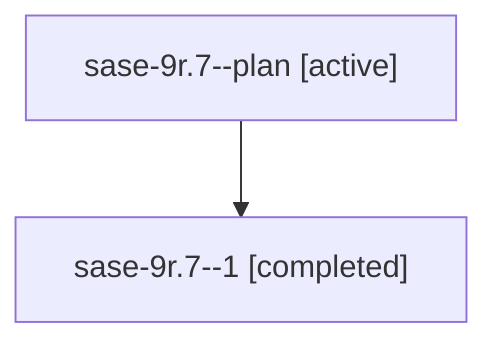

# Family: sase-9r.7

[Agent Hoods](../README.md) / [bbugyi200](../users/bbugyi200/README.md) / [athena](../users/bbugyi200/machines/athena/README.md) / [sase-9r](../users/bbugyi200/machines/athena/hoods/sase-9r/README.md) / sase-9r.7

Owner: `bbugyi200.athena` · Hood: `sase-9r` · Members: 2

## Lineage

The diagram is an optional enhancement; the ordered table below contains the same lineage in accessible text.

| Role | Agent | State | Model / provider | Timing | Commits | Prompt | Chat |
|---|---|---|---|---|---:|---|---|
| plan | sase-9r.7--plan | active | gpt-5.5 / codex | 2026-07-26T10:52:46.429514+00:00 | 0 | [Prompt](../agents/bbugyi200.athena.sase-9r.7--plan/prompt.md) | [Chat](../agents/bbugyi200.athena.sase-9r.7--plan/chat.md) |
| 1 | sase-9r.7--1 | completed | gpt-5.5 / codex | 2026-07-26T11:47:52.114238+00:00 | 0 | — | [Chat](../agents/bbugyi200.athena.sase-9r.7--1/chat.md) |

## Neighbors

| Agent | Relation | State |
|---|---|---|
| [sase-9r.1](../agents/bbugyi200.athena.sase-9r.1/README.md) | sase-9r hood | active |
| [sase-9r.2](../agents/bbugyi200.athena.sase-9r.2/README.md) | sase-9r hood | active |
| [sase-9r.3](../agents/bbugyi200.athena.sase-9r.3/README.md) | sase-9r hood | active |
| [sase-9r.4](../agents/bbugyi200.athena.sase-9r.4/README.md) | sase-9r hood | active |
| [sase-9r.5](../agents/bbugyi200.athena.sase-9r.5/README.md) | sase-9r hood | active |
| [sase-9r.6](../agents/bbugyi200.athena.sase-9r.6/README.md) | sase-9r hood | active |
| [sase-9r.8](../agents/bbugyi200.athena.sase-9r.8/README.md) | sase-9r hood | active |
| [sase-9r.land](../agents/bbugyi200.athena.sase-9r.land/README.md) | sase-9r hood | active |
