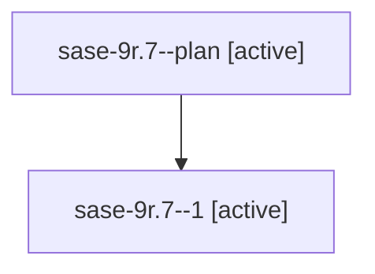

# Family: sase-9r.7

Owner: `bbugyi200.athena` · Hood: `sase-9r` · Members: 2

## Lineage

The diagram is an optional enhancement; the ordered table below contains the same lineage in accessible text.

| Role | Agent | State | Model / provider | Timing | Commits | Prompt | Chat |
|---|---|---|---|---|---:|---|---|
| plan | sase-9r.7--plan | active | gpt-5.5 / codex | 2026-07-26T10:52:46.429514+00:00 | 0 | [Prompt](../agents/bbugyi200.athena.sase-9r.7--plan/prompt.md) | [Chat](../agents/bbugyi200.athena.sase-9r.7--plan/chat.md) |
| 1 | sase-9r.7--1 | active | gpt-5.5 / codex | 2026-07-26T11:47:52.114238+00:00 | 0 | — | — |
