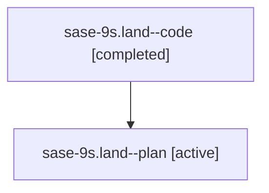

# Family: sase-9s.land

[Agent Hoods](../README.md) / [bbugyi200](../users/bbugyi200/README.md) / [athena](../users/bbugyi200/machines/athena/README.md) / [sase-9s](../users/bbugyi200/machines/athena/hoods/sase-9s/README.md) / sase-9s.land

Owner: `bbugyi200.athena` · Hood: `sase-9s` · Members: 2

## Lineage

The diagram is an optional enhancement; the ordered table below contains the same lineage in accessible text.

| Role | Agent | State | Model / provider | Timing | Commits | Prompt | Chat |
|---|---|---|---|---|---:|---|---|
| code | sase-9s.land--code | completed | gpt-5.6-sol / codex | 2026-07-26T14:43:52.197647+00:00 | [1](../agents/bbugyi200.athena.sase-9s.land--code/README.md#commits) | — | [Chat](../agents/bbugyi200.athena.sase-9s.land--code/chat.md) |
| plan | sase-9s.land--plan | active | claude-fable-5 / claude | 2026-07-26T14:35:07.955333+00:00 | 0 | [Prompt](../agents/bbugyi200.athena.sase-9s.land--plan/prompt.md) | [Chat](../agents/bbugyi200.athena.sase-9s.land--plan/chat.md) |

## Commits

| Role | Commit | Subject | Committed (UTC) |
|---|---|---|---|
| code | [`1cb134f`](https://github.com/sase-org/sase/commit/1cb134fd1cd8e76f8427aad797844a8c681060b8) | test: stabilize post-rebase suite checks (sase-9s) | 2026-07-26 18:43:57 |

## Neighbors

| Agent | Relation | State |
|---|---|---|
| [sase-9s.1](../agents/bbugyi200.athena.sase-9s.1/README.md) | sase-9s hood | active |
| [sase-9s.2](../agents/bbugyi200.athena.sase-9s.2/README.md) | sase-9s hood | active |
| [sase-9s.3](../agents/bbugyi200.athena.sase-9s.3/README.md) | sase-9s hood | active |
| [sase-9s.4](../agents/bbugyi200.athena.sase-9s.4/README.md) | sase-9s hood | active |
| [sase-9s.5](../agents/bbugyi200.athena.sase-9s.5/README.md) | sase-9s hood | active |
| [sase-9s.6](../agents/bbugyi200.athena.sase-9s.6/README.md) | sase-9s hood | active |
| [sase-9s.7](../agents/bbugyi200.athena.sase-9s.7/README.md) | sase-9s hood | active |
| [sase-9s.8](../agents/bbugyi200.athena.sase-9s.8/README.md) | sase-9s hood | active |
