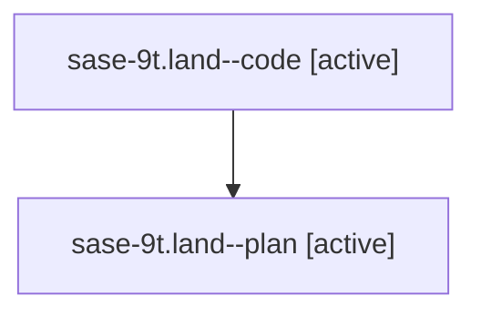

# Family: sase-9t.land

[Agent Hoods](../README.md) / [bbugyi200](../users/bbugyi200/README.md) / [athena](../users/bbugyi200/machines/athena/README.md) / [sase-9t](../users/bbugyi200/machines/athena/hoods/sase-9t/README.md) / sase-9t.land

Owner: `bbugyi200.athena` · Hood: `sase-9t` · Members: 2

## Lineage

The diagram is an optional enhancement; the ordered table below contains the same lineage in accessible text.

| Role | Agent | State | Model / provider | Timing | Commits | Prompt | Chat |
|---|---|---|---|---|---:|---|---|
| code | sase-9t.land--code | active | gpt-5.6-sol / codex | 2026-07-26T15:38:52.828450+00:00 | [1](../agents/bbugyi200.athena.sase-9t.land--code/README.md#commits) | — | — |
| plan | sase-9t.land--plan | active | claude-fable-5 / claude | 2026-07-26T15:19:50.123432+00:00 | 0 | [Prompt](../agents/bbugyi200.athena.sase-9t.land--plan/prompt.md) | [Chat](../agents/bbugyi200.athena.sase-9t.land--plan/chat.md) |

## Commits

| Role | Commit | Subject | Committed (UTC) |
|---|---|---|---|
| code | [`20c131b`](https://github.com/sase-org/sase/commit/20c131b55788ae5d07ea32fcae66328c48e748ab) | build(deps): require sase-core-rs 0.10 (sase-9t) | 2026-07-26 17:01:06 |

## Neighbors

| Agent | Relation | State |
|---|---|---|
| [sase-9t.land.w0](../agents/bbugyi200.athena.sase-9t.land.w0/README.md) | descendant | waiting |
| [sase-9t.1](../agents/bbugyi200.athena.sase-9t.1/README.md) | sase-9t hood | completed |
| [sase-9t.2](../agents/bbugyi200.athena.sase-9t.2/README.md) | sase-9t hood | completed |
| [sase-9t.3](../agents/bbugyi200.athena.sase-9t.3/README.md) | sase-9t hood | completed |
| [sase-9t.4](../agents/bbugyi200.athena.sase-9t.4/README.md) | sase-9t hood | completed |
| [sase-9t.5](../agents/bbugyi200.athena.sase-9t.5/README.md) | sase-9t hood | completed |
| [sase-9t.6](../agents/bbugyi200.athena.sase-9t.6/README.md) | sase-9t hood | completed |
