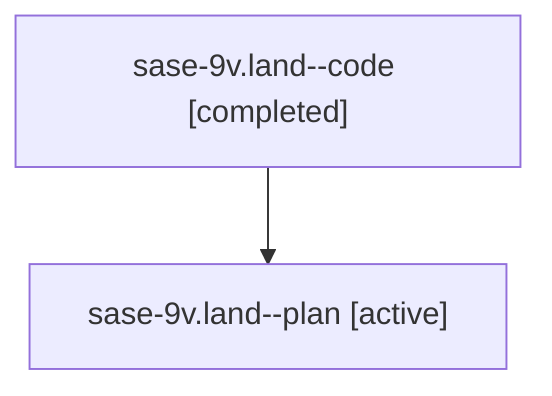

# Family: sase-9v.land

[Agent Hoods](../README.md) / [bbugyi200](../users/bbugyi200/README.md) / [athena](../users/bbugyi200/machines/athena/README.md) / [sase-9v](../users/bbugyi200/machines/athena/hoods/sase-9v/README.md) / sase-9v.land

Owner: `bbugyi200.athena` · Hood: `sase-9v` · Members: 2 · Bead: [sase-9v](https://github.com/sase-org/sase--beads/blob/main/pages/sase-9v/README.md)

## Lineage

The diagram is an optional enhancement; the ordered table below contains the same lineage in accessible text.

| Role | Agent | State | Model / provider | Timing | Commits | Prompt | Chat |
|---|---|---|---|---|---:|---|---|
| code | sase-9v.land--code | completed | gpt-5.6-sol / codex | 2026-07-26T17:37:37.563401+00:00 | [3](../agents/bbugyi200.athena.sase-9v.land--code/README.md#commits) | — | [Chat](../agents/bbugyi200.athena.sase-9v.land--code/chat.md) |
| plan | sase-9v.land--plan | active | claude-fable-5 / claude | 2026-07-26T17:27:43.854350+00:00 | 0 | [Prompt](../agents/bbugyi200.athena.sase-9v.land--plan/prompt.md) | [Chat](../agents/bbugyi200.athena.sase-9v.land--plan/chat.md) |

## Commits

| Role | Repo | Commit | Subject | Committed |
|---|---|---|---|---|
| code | sase | [`bb04762`](https://github.com/sase-org/sase/commit/bb0476224f547a751f81643dbe607089531d5609) | test(bead): fix work-launch push-hint call (sase-9v) | 2026-07-26 14:39:24 EDT |
| code | sase | [`41d02f6`](https://github.com/sase-org/sase/commit/41d02f653a516602ecd01983e23390f9b730387e) | build(deps): require sase-core-rs 0.11 (sase-9v) | 2026-07-26 15:14:03 EDT |
| code | sase | [`9e63c5e`](https://github.com/sase-org/sase/commit/9e63c5eb785c8ed009e74841cf4cc301a5bbcc9d) | fix(agents-sync): skip tribe wait relationships (sase-9v) | 2026-07-26 15:16:03 EDT |

## Neighbors

| Agent | Relation | State |
|---|---|---|
| [sase-9v.1](../agents/bbugyi200.athena.sase-9v.1/README.md) | sase-9v hood | active |
| [sase-9v.10](../agents/bbugyi200.athena.sase-9v.10/README.md) | sase-9v hood | active |
| [sase-9v.11](../agents/bbugyi200.athena.sase-9v.11/README.md) | sase-9v hood | active |
| [sase-9v.2](../agents/bbugyi200.athena.sase-9v.2/README.md) | sase-9v hood | active |
| [sase-9v.3](../agents/bbugyi200.athena.sase-9v.3/README.md) | sase-9v hood | active |
| [sase-9v.4](../agents/bbugyi200.athena.sase-9v.4/README.md) | sase-9v hood | active |
| [sase-9v.5](../agents/bbugyi200.athena.sase-9v.5/README.md) | sase-9v hood | active |
| [sase-9v.6](../agents/bbugyi200.athena.sase-9v.6/README.md) | sase-9v hood | active |
| [sase-9v.7](../agents/bbugyi200.athena.sase-9v.7/README.md) | sase-9v hood | active |
| [sase-9v.8](../agents/bbugyi200.athena.sase-9v.8/README.md) | sase-9v hood | active |
| [sase-9v.9](../agents/bbugyi200.athena.sase-9v.9/README.md) | sase-9v hood | active |
