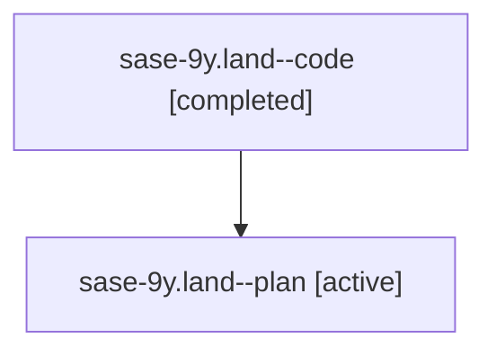

# Family: sase-9y.land

[Agent Hoods](../README.md) / [bbugyi200](../users/bbugyi200/README.md) / [athena](../users/bbugyi200/machines/athena/README.md) / [sase-9y](../users/bbugyi200/machines/athena/hoods/sase-9y/README.md) / sase-9y.land

Owner: `bbugyi200.athena` · Hood: `sase-9y` · Members: 2 · Bead: [sase-9y](https://github.com/sase-org/sase--beads/blob/main/pages/sase-9y/README.md)

## Lineage

The diagram is an optional enhancement; the ordered table below contains the same lineage in accessible text.

| Role | Agent | State | Model / provider | Timing | Commits | Prompt | Chat |
|---|---|---|---|---|---:|---|---|
| code | sase-9y.land--code | completed | gpt-5.6-sol / codex | 2026-07-27T15:55:52.266834+00:00 | [1](../agents/bbugyi200.athena.sase-9y.land--code/README.md#commits) | — | [Chat](../agents/bbugyi200.athena.sase-9y.land--code/chat.md) |
| plan | sase-9y.land--plan | active | gpt-5.6-sol / codex | 2026-07-27T15:41:12.616470+00:00 | 0 | [Prompt](../agents/bbugyi200.athena.sase-9y.land--plan/prompt.md) | [Chat](../agents/bbugyi200.athena.sase-9y.land--plan/chat.md) |

## Commits

| Role | Repo | Commit | Subject | Committed |
|---|---|---|---|---|
| code | sase | [`a947469`](https://github.com/sase-org/sase/commit/a947469eece2988bdfff48bd6ee40b5a9701172f) | docs: record final visual contention baseline (sase-9y) | 2026-07-27 16:24:46 UTC |

## Neighbors

| Agent | Relation | State |
|---|---|---|
| [sase-9y.1](../agents/bbugyi200.athena.sase-9y.1/README.md) | sase-9y hood | active |
| [sase-9y.2](../agents/bbugyi200.athena.sase-9y.2/README.md) | sase-9y hood | active |
| [sase-9y.3](../agents/bbugyi200.athena.sase-9y.3/README.md) | sase-9y hood | active |
| [sase-9y.4](../agents/bbugyi200.athena.sase-9y.4/README.md) | sase-9y hood | active |
