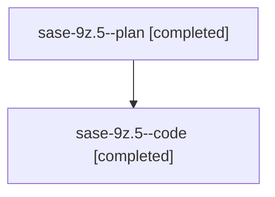

# Family: sase-9z.5

[Agent Hoods](../README.md) / [bbugyi200](../users/bbugyi200/README.md) / [athena](../users/bbugyi200/machines/athena/README.md) / [sase-9z](../users/bbugyi200/machines/athena/hoods/sase-9z/README.md) / sase-9z.5

Owner: `bbugyi200.athena` · Hood: `sase-9z` · Members: 2

## Lineage

The diagram is an optional enhancement; the ordered table below contains the same lineage in accessible text.

| Role | Agent | State | Model / provider | Timing | Commits | Prompt | Chat |
|---|---|---|---|---|---:|---|---|
| plan | sase-9z.5--plan | completed | gpt-5.6-sol / codex | 2026-07-27T13:55:43.313273+00:00 | 0 | [Prompt](../agents/bbugyi200.athena.sase-9z.5--plan/prompt.md) | [Chat](../agents/bbugyi200.athena.sase-9z.5--plan/chat.md) |
| code | sase-9z.5--code | completed | gpt-5.6-sol / codex | 2026-07-27T14:02:55.247804+00:00 | 0 | — | [Chat](../agents/bbugyi200.athena.sase-9z.5--code/chat.md) |

## Neighbors

| Agent | Relation | State |
|---|---|---|
| [sase-9z.1](../agents/bbugyi200.athena.sase-9z.1/README.md) | sase-9z hood | completed |
| [sase-9z.2](../agents/bbugyi200.athena.sase-9z.2/README.md) | sase-9z hood | completed |
| [sase-9z.3](../agents/bbugyi200.athena.sase-9z.3/README.md) | sase-9z hood | completed |
| [sase-9z.4](../agents/bbugyi200.athena.sase-9z.4/README.md) | sase-9z hood | dismissed |
| [sase-9z.land](../agents/bbugyi200.athena.sase-9z.land/README.md) | sase-9z hood | active |
