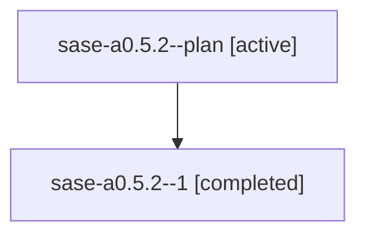

# Family: sase-a0.5.2

[Agent Hoods](../README.md) / [bbugyi200](../users/bbugyi200/README.md) / [athena](../users/bbugyi200/machines/athena/README.md) / [sase-a0](../users/bbugyi200/machines/athena/hoods/sase-a0/README.md) / sase-a0.5.2

Owner: `bbugyi200.athena` · Hood: `sase-a0` · Members: 2 · Bead: [sase-a0.5.2](https://github.com/sase-org/sase--beads/blob/main/pages/sase-a0/sase-a0.5.2.md)

## Lineage

The diagram is an optional enhancement; the ordered table below contains the same lineage in accessible text.

| Role | Agent | State | Model / provider | Timing | Commits | Prompt | Chat |
|---|---|---|---|---|---:|---|---|
| plan | sase-a0.5.2--plan | active | gpt-5.6-sol / codex | 2026-07-27T17:33:25.789841+00:00 | [1](../agents/bbugyi200.athena.sase-a0.5.2--plan/README.md#commits) | [Prompt](../agents/bbugyi200.athena.sase-a0.5.2--plan/prompt.md) | [Chat](../agents/bbugyi200.athena.sase-a0.5.2--plan/chat.md) |
| 1 | sase-a0.5.2--1 | completed | gpt-5.6-sol / codex | 2026-07-27T19:22:22.535007+00:00 | 0 | — | [Chat](../agents/bbugyi200.athena.sase-a0.5.2--1/chat.md) |

## Commits

| Role | Repo | Commit | Subject | Committed |
|---|---|---|---|---|
| plan | sase | [`465b95a`](https://github.com/sase-org/sase/commit/465b95a9f4781b563d3dc814ebe86c22b7bd9489) | build(deps): require published sase-core-rs 0.12.1 (sase-a0.5.2) | 2026-07-27 15:10:22 EDT |

## Neighbors

| Agent | Relation | State |
|---|---|---|
| [sase-a0.5.1](../agents/bbugyi200.athena.sase-a0.5.1/README.md) | sase-a0.5 hood | active |
| [sase-a0.5.3](../agents/bbugyi200.athena.sase-a0.5.3/README.md) | sase-a0.5 hood | active |
| [sase-a0.5.land](../agents/bbugyi200.athena.sase-a0.5.land/README.md) | sase-a0.5 hood | active |
| [sase-a0.1](../agents/bbugyi200.athena.sase-a0.1/README.md) | sase-a0 hood | active |
| [sase-a0.2](../agents/bbugyi200.athena.sase-a0.2/README.md) | sase-a0 hood | active |
| [sase-a0.3](../agents/bbugyi200.athena.sase-a0.3/README.md) | sase-a0 hood | active |
| [sase-a0.4](../agents/bbugyi200.athena.sase-a0.4/README.md) | sase-a0 hood | active |
| [sase-a0.land](../agents/bbugyi200.athena.sase-a0.land/README.md) | sase-a0 hood | active |
