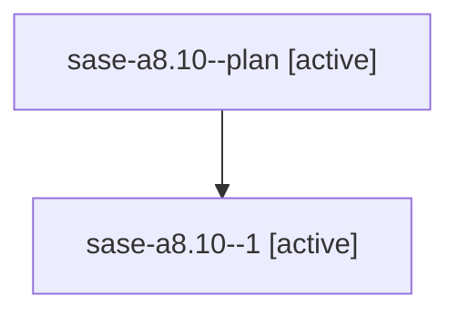

# Family: sase-a8.10

[Agent Hoods](../README.md) / [bbugyi200](../users/bbugyi200/README.md) / [athena](../users/bbugyi200/machines/athena/README.md) / [sase-a8](../users/bbugyi200/machines/athena/hoods/sase-a8/README.md) / sase-a8.10

Owner: `bbugyi200.athena` · Hood: `sase-a8` · Members: 2 · Bead: [sase-a8.10](https://github.com/sase-org/sase--beads/blob/main/pages/sase-a8/sase-a8.10.md)

## Lineage

The diagram is an optional enhancement; the ordered table below contains the same lineage in accessible text.

| Role | Agent | State | Model / provider | Timing | Commits | Prompt | Chat |
|---|---|---|---|---|---:|---|---|
| plan | sase-a8.10--plan | active | gpt-5.5 / codex | 2026-07-28T10:30:18.633827+00:00 | 0 | [Prompt](../agents/bbugyi200.athena.sase-a8.10--plan/prompt.md) | [Chat](../agents/bbugyi200.athena.sase-a8.10--plan/chat.md) |
| 1 | sase-a8.10--1 | active | gpt-5.5 / codex | 2026-07-28T10:33:35.020452+00:00 | 0 | — | — |

## Neighbors

| Agent | Relation | State |
|---|---|---|
| [sase-a8.1](../agents/bbugyi200.athena.sase-a8.1/README.md) | sase-a8 hood | active |
| [sase-a8.2](../agents/bbugyi200.athena.sase-a8.2/README.md) | sase-a8 hood | active |
| [sase-a8.3](../agents/bbugyi200.athena.sase-a8.3/README.md) | sase-a8 hood | active |
| [sase-a8.4](../agents/bbugyi200.athena.sase-a8.4/README.md) | sase-a8 hood | active |
| [sase-a8.5](../agents/bbugyi200.athena.sase-a8.5/README.md) | sase-a8 hood | active |
| [sase-a8.6](../agents/bbugyi200.athena.sase-a8.6/README.md) | sase-a8 hood | active |
| [sase-a8.7](../agents/bbugyi200.athena.sase-a8.7/README.md) | sase-a8 hood | active |
| [sase-a8.8](../agents/bbugyi200.athena.sase-a8.8/README.md) | sase-a8 hood | active |
| [sase-a8.9](../agents/bbugyi200.athena.sase-a8.9/README.md) | sase-a8 hood | active |
| [sase-a8.land](../agents/bbugyi200.athena.sase-a8.land/README.md) | sase-a8 hood | active |
