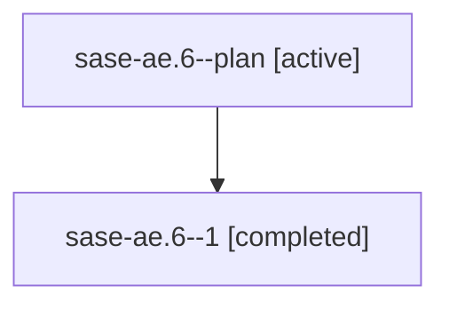

# Family: sase-ae.6

[Agent Hoods](../README.md) / [bbugyi200](../users/bbugyi200/README.md) / [athena](../users/bbugyi200/machines/athena/README.md) / [sase-ae](../users/bbugyi200/machines/athena/hoods/sase-ae/README.md) / sase-ae.6

Owner: `bbugyi200.athena` · Hood: `sase-ae` · Members: 2

## Lineage

The diagram is an optional enhancement; the ordered table below contains the same lineage in accessible text.

| Role | Agent | State | Model / provider | Timing | Commits | Prompt | Chat |
|---|---|---|---|---|---:|---|---|
| plan | sase-ae.6--plan | active | opus / claude | 2026-07-28T13:29:56.524470+00:00 | 0 | [Prompt](../agents/bbugyi200.athena.sase-ae.6--plan/prompt.md) | [Chat](../agents/bbugyi200.athena.sase-ae.6--plan/chat.md) |
| 1 | sase-ae.6--1 | completed | opus / claude | 2026-07-28T13:32:15.141954+00:00 | [1](../agents/bbugyi200.athena.sase-ae.6--1/README.md#commits) | — | [Chat](../agents/bbugyi200.athena.sase-ae.6--1/chat.md) |

## Commits

| Role | Repo | Commit | Subject | Committed |
|---|---|---|---|---|
| 1 | sase | [`53d732f`](https://github.com/sase-org/sase/commit/53d732f30e91839e58eee9047d6e6b5a18cd248f) | docs: document the commit-then-deploy skill workflow (sase-ae.6) | 2026-07-28 09:48:41 EDT |

## Neighbors

| Agent | Relation | State |
|---|---|---|
| [sase-ae.1](../agents/bbugyi200.athena.sase-ae.1/README.md) | sase-ae hood | active |
| [sase-ae.2](../agents/bbugyi200.athena.sase-ae.2/README.md) | sase-ae hood | active |
| [sase-ae.3](../agents/bbugyi200.athena.sase-ae.3/README.md) | sase-ae hood | active |
| [sase-ae.4](../agents/bbugyi200.athena.sase-ae.4/README.md) | sase-ae hood | active |
| [sase-ae.5](../agents/bbugyi200.athena.sase-ae.5/README.md) | sase-ae hood | active |
| [sase-ae.land](bbugyi200.athena.sase-ae.land.md) (family · 2) | sase-ae hood | active 1, completed 1 |
