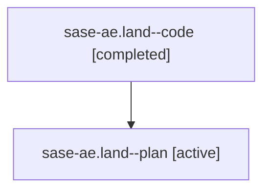

# Family: sase-ae.land

[Agent Hoods](../README.md) / [bbugyi200](../users/bbugyi200/README.md) / [athena](../users/bbugyi200/machines/athena/README.md) / [sase-ae](../users/bbugyi200/machines/athena/hoods/sase-ae/README.md) / sase-ae.land

Owner: `bbugyi200.athena` · Hood: `sase-ae` · Members: 2 · Bead: [sase-ae](https://github.com/sase-org/sase--beads/blob/main/pages/sase-ae/README.md)

## Lineage

The diagram is an optional enhancement; the ordered table below contains the same lineage in accessible text.

| Role | Agent | State | Model / provider | Timing | Commits | Prompt | Chat |
|---|---|---|---|---|---:|---|---|
| code | sase-ae.land--code | completed | gpt-5.6-sol / codex | 2026-07-28T14:04:49.843504+00:00 | [1](../agents/bbugyi200.athena.sase-ae.land--code/README.md#commits) | — | [Chat](../agents/bbugyi200.athena.sase-ae.land--code/chat.md) |
| plan | sase-ae.land--plan | active | opus / claude | 2026-07-28T13:50:08.289451+00:00 | 0 | [Prompt](../agents/bbugyi200.athena.sase-ae.land--plan/prompt.md) | [Chat](../agents/bbugyi200.athena.sase-ae.land--plan/chat.md) |

## Commits

| Role | Repo | Commit | Subject | Committed |
|---|---|---|---|---|
| code | sase | [`7d85188`](https://github.com/sase-org/sase/commit/7d85188c18080e4e986e8fd65394144c8ae9ce2f) | test(skills): cover backwards manifest ABA refusal (sase-ae) | 2026-07-28 14:11:00 UTC |

## Neighbors

| Agent | Relation | State |
|---|---|---|
| [sase-ae.1](../agents/bbugyi200.athena.sase-ae.1/README.md) | sase-ae hood | active |
| [sase-ae.2](../agents/bbugyi200.athena.sase-ae.2/README.md) | sase-ae hood | active |
| [sase-ae.3](../agents/bbugyi200.athena.sase-ae.3/README.md) | sase-ae hood | active |
| [sase-ae.4](../agents/bbugyi200.athena.sase-ae.4/README.md) | sase-ae hood | active |
| [sase-ae.5](../agents/bbugyi200.athena.sase-ae.5/README.md) | sase-ae hood | active |
| [sase-ae.6](bbugyi200.athena.sase-ae.6.md) (family · 2) | sase-ae hood | active 1, completed 1 |
