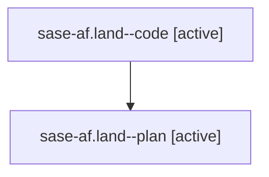

# Family: sase-af.land

[Agent Hoods](../README.md) / [bbugyi200](../users/bbugyi200/README.md) / [athena](../users/bbugyi200/machines/athena/README.md) / [sase-af](../users/bbugyi200/machines/athena/hoods/sase-af/README.md) / sase-af.land

Owner: `bbugyi200.athena` · Hood: `sase-af` · Members: 2

## Lineage

The diagram is an optional enhancement; the ordered table below contains the same lineage in accessible text.

| Role | Agent | State | Model / provider | Timing | Commits | Prompt | Chat |
|---|---|---|---|---|---:|---|---|
| code | sase-af.land--code | active | gpt-5.6-sol / codex | 2026-07-28T15:04:34.396196+00:00 | [1](../agents/bbugyi200.athena.sase-af.land--code/README.md#commits) | — | — |
| plan | sase-af.land--plan | active | gpt-5.6-sol / codex | 2026-07-28T14:52:00.997560+00:00 | 0 | [Prompt](../agents/bbugyi200.athena.sase-af.land--plan/prompt.md) | [Chat](../agents/bbugyi200.athena.sase-af.land--plan/chat.md) |

## Commits

| Role | Repo | Commit | Subject | Committed |
|---|---|---|---|---|
| code | sase | [`a643a86`](https://github.com/sase-org/sase/commit/a643a864c33b1eb864f570c9e009ff89d313a69f) | fix(sdd): keep published core integration commit-safe (sase-af) | 2026-07-28 12:18:15 EDT |

## Neighbors

| Agent | Relation | State |
|---|---|---|
| [sase-af.land.f0](../agents/bbugyi200.athena.sase-af.land.f0/README.md) | descendant | waiting |
| [sase-af.1](../agents/bbugyi200.athena.sase-af.1/README.md) | sase-af hood | active |
| [sase-af.2](../agents/bbugyi200.athena.sase-af.2/README.md) | sase-af hood | active |
| [sase-af.3](../agents/bbugyi200.athena.sase-af.3/README.md) | sase-af hood | active |
