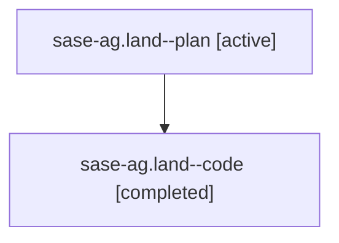

# Family: sase-ag.land

[Agent Hoods](../README.md) / [bbugyi200](../users/bbugyi200/README.md) / [athena](../users/bbugyi200/machines/athena/README.md) / [sase-ag](../users/bbugyi200/machines/athena/hoods/sase-ag/README.md) / sase-ag.land

Owner: `bbugyi200.athena` · Hood: `sase-ag` · Members: 2 · Bead: [sase-ag](https://github.com/sase-org/sase--beads/blob/main/pages/sase-ag/README.md)

## Lineage

The diagram is an optional enhancement; the ordered table below contains the same lineage in accessible text.

| Role | Agent | State | Model / provider | Timing | Commits | Prompt | Chat |
|---|---|---|---|---|---:|---|---|
| plan | sase-ag.land--plan | active | opus / claude | 2026-07-28T16:54:26.065845+00:00 | 0 | [Prompt](../agents/bbugyi200.athena.sase-ag.land--plan/prompt.md) | [Chat](../agents/bbugyi200.athena.sase-ag.land--plan/chat.md) |
| code | sase-ag.land--code | completed | gpt-5.6-sol / codex | 2026-07-28T17:13:02.851275+00:00 | [1](../agents/bbugyi200.athena.sase-ag.land--code/README.md#commits) | — | [Chat](../agents/bbugyi200.athena.sase-ag.land--code/chat.md) |

## Commits

| Role | Repo | Commit | Subject | Committed |
|---|---|---|---|---|
| code | sase | [`702f1ae`](https://github.com/sase-org/sase/commit/702f1aece2375113427d437497924e960d5ca735) | build(deps): require sase-core-rs 0.12.4 (sase-ag) | 2026-07-28 14:03:38 EDT |

## Neighbors

| Agent | Relation | State |
|---|---|---|
| [sase-ag.land.f0](../agents/bbugyi200.athena.sase-ag.land.f0/README.md) | descendant | active |
| [sase-ag.land.w0](../agents/bbugyi200.athena.sase-ag.land.w0/README.md) | descendant | active |
| [sase-ag.land.w1](../agents/bbugyi200.athena.sase-ag.land.w1/README.md) | descendant | waiting |
| [sase-ag.1](../agents/bbugyi200.athena.sase-ag.1/README.md) | sase-ag hood | active |
| [sase-ag.2](../agents/bbugyi200.athena.sase-ag.2/README.md) | sase-ag hood | active |
| [sase-ag.3](../agents/bbugyi200.athena.sase-ag.3/README.md) | sase-ag hood | active |
| [sase-ag.4](../agents/bbugyi200.athena.sase-ag.4/README.md) | sase-ag hood | active |
| [sase-ag.5](../agents/bbugyi200.athena.sase-ag.5/README.md) | sase-ag hood | active |
| [sase-ag.6](../agents/bbugyi200.athena.sase-ag.6/README.md) | sase-ag hood | active |
