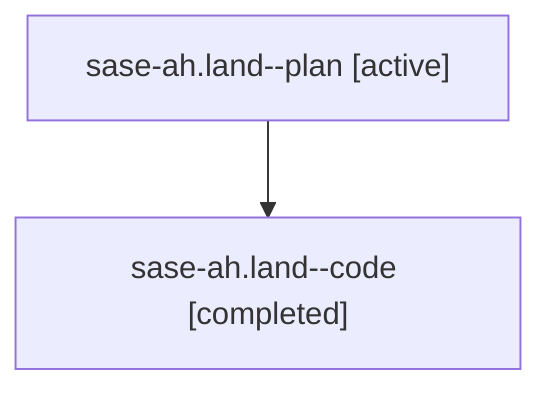

# Family: sase-ah.land

[Agent Hoods](../README.md) / [bbugyi200](../users/bbugyi200/README.md) / [athena](../users/bbugyi200/machines/athena/README.md) / [sase-ah](../users/bbugyi200/machines/athena/hoods/sase-ah/README.md) / sase-ah.land

Owner: `bbugyi200.athena` · Hood: `sase-ah` · Members: 2

## Lineage

The diagram is an optional enhancement; the ordered table below contains the same lineage in accessible text.

| Role | Agent | State | Model / provider | Timing | Commits | Prompt | Chat |
|---|---|---|---|---|---:|---|---|
| plan | sase-ah.land--plan | active | gpt-5.6-sol / codex | 2026-07-28T19:52:05.148096+00:00 | 0 | [Prompt](../agents/bbugyi200.athena.sase-ah.land--plan/prompt.md) | [Chat](../agents/bbugyi200.athena.sase-ah.land--plan/chat.md) |
| code | sase-ah.land--code | completed | gpt-5.6-sol / codex | 2026-07-28T20:01:39.144268+00:00 | [2](../agents/bbugyi200.athena.sase-ah.land--code/README.md#commits) | — | [Chat](../agents/bbugyi200.athena.sase-ah.land--code/chat.md) |

## Commits

| Role | Repo | Commit | Subject | Committed |
|---|---|---|---|---|
| code | sase | [`8d34bc9`](https://github.com/sase-org/sase/commit/8d34bc9ae0f093f4170229cf78a7dafe8007a26f) | test: keep suite gate socket paths below Linux limits | 2026-07-28 16:38:40 EDT |
| code | sase | [`7ba8b1c`](https://github.com/sase-org/sase/commit/7ba8b1ceab7d6652e011ac4461c1745e69f91997) | test: preserve suite-gate holder status at timeout | 2026-07-28 17:01:02 EDT |

## Neighbors

| Agent | Relation | State |
|---|---|---|
| [sase-ah.1](../agents/bbugyi200.athena.sase-ah.1/README.md) | sase-ah hood | active |
| [sase-ah.2](../agents/bbugyi200.athena.sase-ah.2/README.md) | sase-ah hood | active |
| [sase-ah.3](../agents/bbugyi200.athena.sase-ah.3/README.md) | sase-ah hood | active |
