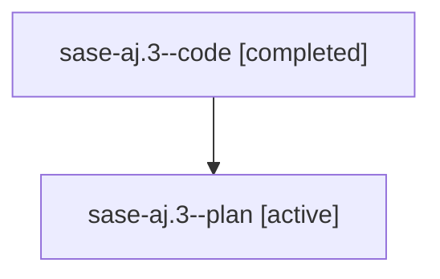

# Family: sase-aj.3

[Agent Hoods](../README.md) / [bbugyi200](../users/bbugyi200/README.md) / [athena](../users/bbugyi200/machines/athena/README.md) / [sase-aj](../users/bbugyi200/machines/athena/hoods/sase-aj/README.md) / sase-aj.3

Owner: `bbugyi200.athena` · Hood: `sase-aj` · Members: 2 · Bead: [sase-aj.3](https://github.com/sase-org/sase--beads/blob/main/pages/sase-aj/sase-aj.3.md)

## Lineage

The diagram is an optional enhancement; the ordered table below contains the same lineage in accessible text.

| Role | Agent | State | Model / provider | Timing | Commits | Prompt | Chat |
|---|---|---|---|---|---:|---|---|
| code | sase-aj.3--code | completed | gpt-5.6-sol / codex | 2026-07-28T21:57:19.727325+00:00 | [1](../agents/bbugyi200.athena.sase-aj.3--code/README.md#commits) | — | [Chat](../agents/bbugyi200.athena.sase-aj.3--code/chat.md) |
| plan | sase-aj.3--plan | active | gpt-5.6-sol / codex | 2026-07-28T21:52:31.772513+00:00 | 0 | [Prompt](../agents/bbugyi200.athena.sase-aj.3--plan/prompt.md) | [Chat](../agents/bbugyi200.athena.sase-aj.3--plan/chat.md) |

## Commits

| Role | Repo | Commit | Subject | Committed |
|---|---|---|---|---|
| code | sase | [`1943e18`](https://github.com/sase-org/sase/commit/1943e18a74f5f2ca3731dd051e68837574ea1c1e) | feat(beads): preassign epic work before launch | 2026-07-28 18:30:42 EDT |

## Neighbors

| Agent | Relation | State |
|---|---|---|
| [sase-aj.1](../agents/bbugyi200.athena.sase-aj.1/README.md) | sase-aj hood | active |
| [sase-aj.2](../agents/bbugyi200.athena.sase-aj.2/README.md) | sase-aj hood | active |
| [sase-aj.4](../agents/bbugyi200.athena.sase-aj.4/README.md) | sase-aj hood | active |
| [sase-aj.5](../agents/bbugyi200.athena.sase-aj.5/README.md) | sase-aj hood | active |
| [sase-aj.6](../agents/bbugyi200.athena.sase-aj.6/README.md) | sase-aj hood | active |
| [sase-aj.land](../agents/bbugyi200.athena.sase-aj.land/README.md) | sase-aj hood | active |
