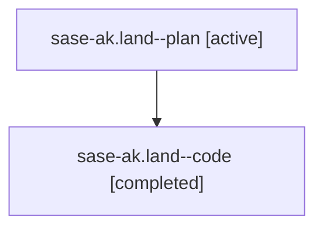

# Family: sase-ak.land

[Agent Hoods](../README.md) / [bbugyi200](../users/bbugyi200/README.md) / [athena](../users/bbugyi200/machines/athena/README.md) / [sase-ak](../users/bbugyi200/machines/athena/hoods/sase-ak/README.md) / sase-ak.land

Owner: `bbugyi200.athena` · Hood: `sase-ak` · Members: 2 · Bead: [sase-ak](https://github.com/sase-org/sase--beads/blob/main/pages/sase-ak/README.md)

## Lineage

The diagram is an optional enhancement; the ordered table below contains the same lineage in accessible text.

| Role | Agent | State | Model / provider | Timing | Commits | Prompt | Chat |
|---|---|---|---|---|---:|---|---|
| plan | sase-ak.land--plan | active | gpt-5.6-sol / codex | 2026-07-28T22:15:29.253773+00:00 | 0 | [Prompt](../agents/bbugyi200.athena.sase-ak.land--plan/prompt.md) | [Chat](../agents/bbugyi200.athena.sase-ak.land--plan/chat.md) |
| code | sase-ak.land--code | completed | gpt-5.6-sol / codex | 2026-07-28T22:23:15.565320+00:00 | [1](../agents/bbugyi200.athena.sase-ak.land--code/README.md#commits) | — | [Chat](../agents/bbugyi200.athena.sase-ak.land--code/chat.md) |

## Commits

| Role | Repo | Commit | Subject | Committed |
|---|---|---|---|---|
| code | sase | [`0b3d16c`](https://github.com/sase-org/sase/commit/0b3d16ce40b7b0d20aa504d748c4147d3dfc9967) | fix(ace): finish tribe wait integration | 2026-07-28 22:36:19 UTC |

## Neighbors

| Agent | Relation | State |
|---|---|---|
| [sase-ak.1](../agents/bbugyi200.athena.sase-ak.1/README.md) | sase-ak hood | active |
| [sase-ak.2](../agents/bbugyi200.athena.sase-ak.2/README.md) | sase-ak hood | active |
| [sase-ak.3](../agents/bbugyi200.athena.sase-ak.3/README.md) | sase-ak hood | active |
| [sase-ak.4](../agents/bbugyi200.athena.sase-ak.4/README.md) | sase-ak hood | active |
