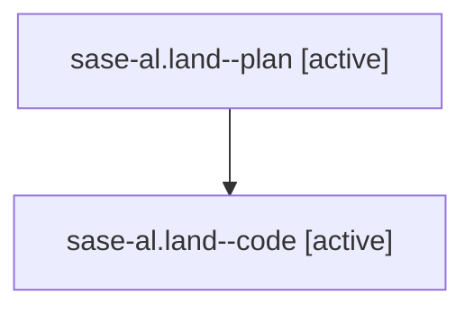

# Family: sase-al.land

[Agent Hoods](../README.md) / [bbugyi200](../users/bbugyi200/README.md) / [athena](../users/bbugyi200/machines/athena/README.md) / [sase-al](../users/bbugyi200/machines/athena/hoods/sase-al/README.md) / sase-al.land

Owner: `bbugyi200.athena` · Hood: `sase-al` · Members: 2

## Lineage

The diagram is an optional enhancement; the ordered table below contains the same lineage in accessible text.

| Role | Agent | State | Model / provider | Timing | Commits | Prompt | Chat |
|---|---|---|---|---|---:|---|---|
| plan | sase-al.land--plan | active | gpt-5.6-sol / codex | 2026-07-28T22:47:22.571184+00:00 | 0 | [Prompt](../agents/bbugyi200.athena.sase-al.land--plan/prompt.md) | [Chat](../agents/bbugyi200.athena.sase-al.land--plan/chat.md) |
| code | sase-al.land--code | active | gpt-5.6-sol / codex | 2026-07-28T22:57:04.750982+00:00 | [2](../agents/bbugyi200.athena.sase-al.land--code/README.md#commits) | — | — |

## Commits

| Role | Commit | Subject | Committed (UTC) |
|---|---|---|---|
| code | [`41a01b3`](https://github.com/sase-org/sase/commit/41a01b397c79303acad241f2a44822193b3aeb32) | ci: emit valid split SDD store record | 2026-07-28 23:12:14 |
| code | [`887999f`](https://github.com/sase-org/sase/commit/887999fb5d0c7acd0ca0a232e9a98f33d1fcc182) | fix(ci): stabilize full matrix isolation | 2026-07-29 01:50:44 |

## Neighbors

| Agent | Relation | State |
|---|---|---|
| [sase-al.1](../agents/bbugyi200.athena.sase-al.1/README.md) | sase-al hood | completed |
| [sase-al.2](../agents/bbugyi200.athena.sase-al.2/README.md) | sase-al hood | completed |
