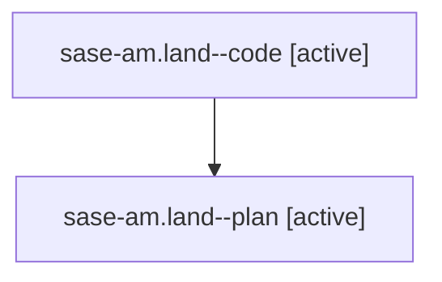

# Family: sase-am.land

[Agent Hoods](../README.md) / [bbugyi200](../users/bbugyi200/README.md) / [athena](../users/bbugyi200/machines/athena/README.md) / [sase-am](../users/bbugyi200/machines/athena/hoods/sase-am/README.md) / sase-am.land

Owner: `bbugyi200.athena` · Hood: `sase-am` · Members: 2

## Lineage

The diagram is an optional enhancement; the ordered table below contains the same lineage in accessible text.

| Role | Agent | State | Model / provider | Timing | Commits | Prompt | Chat |
|---|---|---|---|---|---:|---|---|
| code | sase-am.land--code | active | gpt-5.6-sol / codex | 2026-07-28T23:37:34.307971+00:00 | 0 | — | — |
| plan | sase-am.land--plan | active | gpt-5.6-sol / codex | 2026-07-28T23:26:35.861844+00:00 | 0 | [Prompt](../agents/bbugyi200.athena.sase-am.land--plan/prompt.md) | [Chat](../agents/bbugyi200.athena.sase-am.land--plan/chat.md) |

## Neighbors

| Agent | Relation | State |
|---|---|---|
| [sase-am.1](../agents/bbugyi200.athena.sase-am.1/README.md) | sase-am hood | completed |
| [sase-am.2](../agents/bbugyi200.athena.sase-am.2/README.md) | sase-am hood | completed |
| [sase-am.3](../agents/bbugyi200.athena.sase-am.3/README.md) | sase-am hood | completed |
| [sase-am.4](../agents/bbugyi200.athena.sase-am.4/README.md) | sase-am hood | completed |
