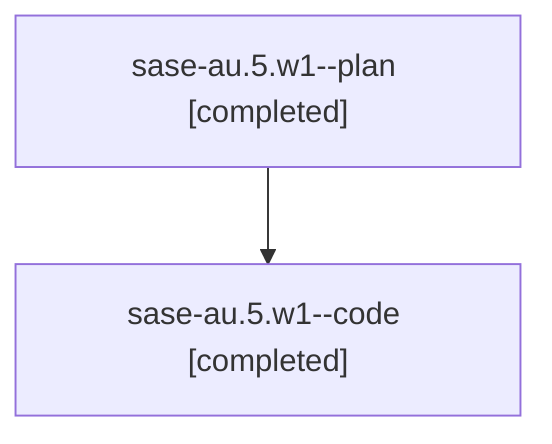

# Family: sase-au.5.w1

[Agent Hoods](../README.md) / [bbugyi200](../users/bbugyi200/README.md) / [athena](../users/bbugyi200/machines/athena/README.md) / [sase-au](../users/bbugyi200/machines/athena/hoods/sase-au/README.md) / sase-au.5.w1

Owner: `bbugyi200.athena` · Hood: `sase-au` · Members: 2

## Lineage

The diagram is an optional enhancement; the ordered table below contains the same lineage in accessible text.

| Role | Agent | State | Model / provider | Timing | Commits | Prompt | Chat |
|---|---|---|---|---|---:|---|---|
| plan | sase-au.5.w1--plan | completed | opus / claude | 2026-07-29T17:53:47.537049+00:00 | 0 | [Prompt](../agents/bbugyi200.athena.sase-au.5.w1--plan/prompt.md) | [Chat](../agents/bbugyi200.athena.sase-au.5.w1--plan/chat.md) |
| code | sase-au.5.w1--code | completed | gpt-5.6-sol / codex | 2026-07-29T18:06:35.031642+00:00 | [1](../agents/bbugyi200.athena.sase-au.5.w1--code/README.md#commits) | — | [Chat](../agents/bbugyi200.athena.sase-au.5.w1--code/chat.md) |

## Commits

| Role | Commit | Subject | Committed (UTC) |
|---|---|---|---|
| code | [`216d027`](https://github.com/sase-org/sase/commit/216d027d8ba439f6156b45557750e292c029311b) | feat(ace): add numbered Statistics subtabs | 2026-07-29 18:35:55 |

## Neighbors

| Agent | Relation | State |
|---|---|---|
| [sase-au.5](../agents/bbugyi200.athena.sase-au.5/README.md) | ancestor | completed |
| [sase-au.5.w0](../agents/bbugyi200.athena.sase-au.5.w0/README.md) | sase-au.5 hood | waiting |
| [sase-au.1](../agents/bbugyi200.athena.sase-au.1/README.md) | sase-au hood | completed |
| [sase-au.2](../agents/bbugyi200.athena.sase-au.2/README.md) | sase-au hood | completed |
| [sase-au.3](../agents/bbugyi200.athena.sase-au.3/README.md) | sase-au hood | completed |
| [sase-au.4](../agents/bbugyi200.athena.sase-au.4/README.md) | sase-au hood | completed |
| [sase-au.6](../agents/bbugyi200.athena.sase-au.6/README.md) | sase-au hood | active |
| [sase-au.land](../agents/bbugyi200.athena.sase-au.land/README.md) | sase-au hood | waiting |
