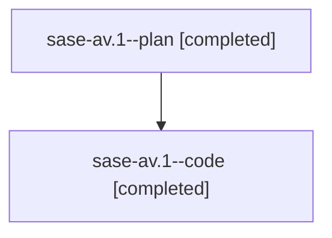

# Family: sase-av.1

[Agent Hoods](../README.md) / [bbugyi200](../users/bbugyi200/README.md) / [athena](../users/bbugyi200/machines/athena/README.md) / [sase-av](../users/bbugyi200/machines/athena/hoods/sase-av/README.md) / sase-av.1

Owner: `bbugyi200.athena` · Hood: `sase-av` · Members: 2

## Lineage

The diagram is an optional enhancement; the ordered table below contains the same lineage in accessible text.

| Role | Agent | State | Model / provider | Timing | Commits | Prompt | Chat |
|---|---|---|---|---|---:|---|---|
| plan | sase-av.1--plan | completed | gpt-5.6-sol / codex | 2026-07-29T16:50:56.837332+00:00 | 0 | [Prompt](../agents/bbugyi200.athena.sase-av.1--plan/prompt.md) | [Chat](../agents/bbugyi200.athena.sase-av.1--plan/chat.md) |
| code | sase-av.1--code | completed | gpt-5.6-sol / codex | 2026-07-29T16:54:15.456477+00:00 | 0 | — | [Chat](../agents/bbugyi200.athena.sase-av.1--code/chat.md) |

## Neighbors

| Agent | Relation | State |
|---|---|---|
| [sase-av.2](../agents/bbugyi200.athena.sase-av.2/README.md) | sase-av hood | completed |
| [sase-av.3](../agents/bbugyi200.athena.sase-av.3/README.md) | sase-av hood | completed |
| [sase-av.4](../agents/bbugyi200.athena.sase-av.4/README.md) | sase-av hood | completed |
| [sase-av.5](../agents/bbugyi200.athena.sase-av.5/README.md) | sase-av hood | completed |
| [sase-av.6](bbugyi200.athena.sase-av.6.md) (family · 2) | sase-av hood | active 2 |
| [sase-av.7](bbugyi200.athena.sase-av.7.md) (family · 2) | sase-av hood | active 2 |
| [sase-av.8](../agents/bbugyi200.athena.sase-av.8/README.md) | sase-av hood | waiting |
| [sase-av.land](../agents/bbugyi200.athena.sase-av.land/README.md) | sase-av hood | waiting |
