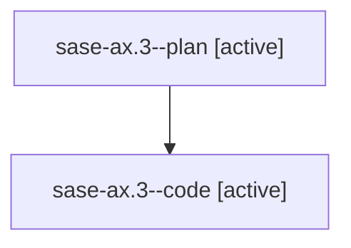

# Family: sase-ax.3

[Agent Hoods](../README.md) / [bbugyi200](../users/bbugyi200/README.md) / [athena](../users/bbugyi200/machines/athena/README.md) / [sase-ax](../users/bbugyi200/machines/athena/hoods/sase-ax/README.md) / sase-ax.3

Owner: `bbugyi200.athena` · Hood: `sase-ax` · Members: 2

## Lineage

The diagram is an optional enhancement; the ordered table below contains the same lineage in accessible text.

| Role | Agent | State | Model / provider | Timing | Commits | Prompt | Chat |
|---|---|---|---|---|---:|---|---|
| plan | sase-ax.3--plan | active | gpt-5.6-sol / codex | 2026-07-29T21:36:53.445659+00:00 | 0 | [Prompt](../agents/bbugyi200.athena.sase-ax.3--plan/prompt.md) | [Chat](../agents/bbugyi200.athena.sase-ax.3--plan/chat.md) |
| code | sase-ax.3--code | active | gpt-5.6-sol / codex | 2026-07-29T21:41:44.554573+00:00 | 0 | — | — |

## Neighbors

| Agent | Relation | State |
|---|---|---|
| [sase-ax.3.w0](../agents/bbugyi200.athena.sase-ax.3.w0/README.md) | descendant | waiting |
| [sase-ax.1](../agents/bbugyi200.athena.sase-ax.1/README.md) | sase-ax hood | completed |
| [sase-ax.2](../agents/bbugyi200.athena.sase-ax.2/README.md) | sase-ax hood | completed |
| [sase-ax.4](../agents/bbugyi200.athena.sase-ax.4/README.md) | sase-ax hood | waiting |
| [sase-ax.land](../agents/bbugyi200.athena.sase-ax.land/README.md) | sase-ax hood | waiting |
