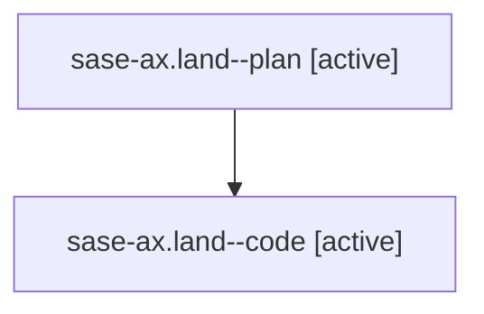

# Family: sase-ax.land

[Agent Hoods](../README.md) / [bbugyi200](../users/bbugyi200/README.md) / [athena](../users/bbugyi200/machines/athena/README.md) / [sase-ax](../users/bbugyi200/machines/athena/hoods/sase-ax/README.md) / sase-ax.land

Owner: `bbugyi200.athena` · Hood: `sase-ax` · Members: 2

## Lineage

The diagram is an optional enhancement; the ordered table below contains the same lineage in accessible text.

| Role | Agent | State | Model / provider | Timing | Commits | Prompt | Chat |
|---|---|---|---|---|---:|---|---|
| plan | sase-ax.land--plan | active | gpt-5.6-sol / codex | 2026-07-29T23:24:17.385913+00:00 | 0 | [Prompt](../agents/bbugyi200.athena.sase-ax.land--plan/prompt.md) | [Chat](../agents/bbugyi200.athena.sase-ax.land--plan/chat.md) |
| code | sase-ax.land--code | active | gpt-5.6-sol / codex | 2026-07-29T23:30:39.615450+00:00 | [1](../agents/bbugyi200.athena.sase-ax.land--code/README.md#commits) | — | — |

## Commits

| Role | Repo | Commit | Subject | Committed |
|---|---|---|---|---|
| code | sase | [`af42951`](https://github.com/sase-org/sase/commit/af42951798753ef28a2c73e75bcbef1780dbfb83) | perf: warm artifact completion through Rust query | 2026-07-29 19:46:56 EDT |

## Neighbors

| Agent | Relation | State |
|---|---|---|
| [sase-ax.1](../agents/bbugyi200.athena.sase-ax.1/README.md) | sase-ax hood | completed |
| [sase-ax.2](../agents/bbugyi200.athena.sase-ax.2/README.md) | sase-ax hood | completed |
| [sase-ax.3](bbugyi200.athena.sase-ax.3.md) (family · 2) | sase-ax hood | completed 2 |
| [sase-ax.3.w0](../agents/bbugyi200.athena.sase-ax.3.w0/README.md) | sase-ax hood | failed |
| [sase-ax.4](../agents/bbugyi200.athena.sase-ax.4/README.md) | sase-ax hood | completed |
