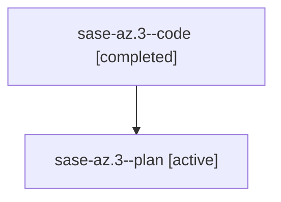

# Family: sase-az.3

[Agent Hoods](../README.md) / [bbugyi200](../users/bbugyi200/README.md) / [athena](../users/bbugyi200/machines/athena/README.md) / [sase-az](../users/bbugyi200/machines/athena/hoods/sase-az/README.md) / sase-az.3

Owner: `bbugyi200.athena` · Hood: `sase-az` · Members: 2 · Bead: [sase-az.3](https://github.com/sase-org/sase--beads/blob/main/pages/sase-az/sase-az.3.md)

## Lineage

The diagram is an optional enhancement; the ordered table below contains the same lineage in accessible text.

| Role | Agent | State | Model / provider | Timing | Commits | Prompt | Chat |
|---|---|---|---|---|---:|---|---|
| code | sase-az.3--code | completed | gpt-5.6-sol / codex | 2026-07-30T00:34:46.640747+00:00 | [1](../agents/bbugyi200.athena.sase-az.3--code/README.md#commits) | — | [Chat](../agents/bbugyi200.athena.sase-az.3--code/chat.md) |
| plan | sase-az.3--plan | active | gpt-5.6-sol / codex | 2026-07-30T00:29:40.393917+00:00 | 0 | [Prompt](../agents/bbugyi200.athena.sase-az.3--plan/prompt.md) | [Chat](../agents/bbugyi200.athena.sase-az.3--plan/chat.md) |

## Commits

| Role | Repo | Commit | Subject | Committed |
|---|---|---|---|---|
| code | sase | [`3da9140`](https://github.com/sase-org/sase/commit/3da9140b4968f590f84ace1db91f21c565746381) | feat(ace): add contextual Copy as palette | 2026-07-30 01:14:52 UTC |

## Neighbors

| Agent | Relation | State |
|---|---|---|
| [sase-az.1](../agents/bbugyi200.athena.sase-az.1/README.md) | sase-az hood | active |
| [sase-az.2](../agents/bbugyi200.athena.sase-az.2/README.md) | sase-az hood | active |
| [sase-az.4](../agents/bbugyi200.athena.sase-az.4/README.md) | sase-az hood | active |
| [sase-az.land](bbugyi200.athena.sase-az.land.md) (family · 2) | sase-az hood | active 1, completed 1 |
