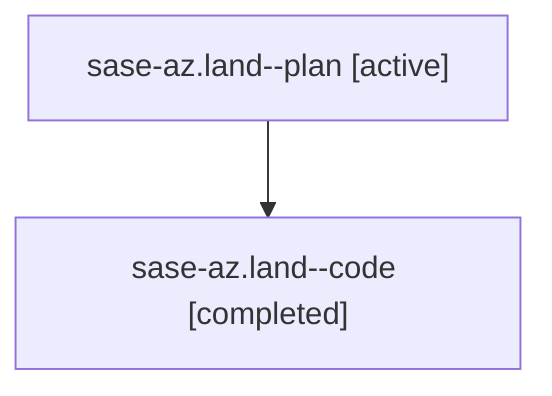

# Family: sase-az.land

[Agent Hoods](../README.md) / [bbugyi200](../users/bbugyi200/README.md) / [athena](../users/bbugyi200/machines/athena/README.md) / [sase-az](../users/bbugyi200/machines/athena/hoods/sase-az/README.md) / sase-az.land

Owner: `bbugyi200.athena` · Hood: `sase-az` · Members: 2 · Bead: [sase-az](https://github.com/sase-org/sase--beads/blob/main/pages/sase-az/README.md)

## Lineage

The diagram is an optional enhancement; the ordered table below contains the same lineage in accessible text.

| Role | Agent | State | Model / provider | Timing | Commits | Prompt | Chat |
|---|---|---|---|---|---:|---|---|
| plan | sase-az.land--plan | active | gpt-5.6-sol / codex | 2026-07-30T01:53:04.790755+00:00 | 0 | [Prompt](../agents/bbugyi200.athena.sase-az.land--plan/prompt.md) | [Chat](../agents/bbugyi200.athena.sase-az.land--plan/chat.md) |
| code | sase-az.land--code | completed | gpt-5.6-sol / codex | 2026-07-30T02:05:34.949020+00:00 | [1](../agents/bbugyi200.athena.sase-az.land--code/README.md#commits) | — | [Chat](../agents/bbugyi200.athena.sase-az.land--code/chat.md) |

## Commits

| Role | Repo | Commit | Subject | Committed |
|---|---|---|---|---|
| code | sase | [`86fb630`](https://github.com/sase-org/sase/commit/86fb630bb8315f86895a48ac4a9be1a9243e8612) | feat(ace): complete Files copy-as palette | 2026-07-30 02:28:02 UTC |

## Neighbors

| Agent | Relation | State |
|---|---|---|
| [sase-az.1](../agents/bbugyi200.athena.sase-az.1/README.md) | sase-az hood | active |
| [sase-az.2](../agents/bbugyi200.athena.sase-az.2/README.md) | sase-az hood | active |
| [sase-az.3](bbugyi200.athena.sase-az.3.md) (family · 2) | sase-az hood | active 1, completed 1 |
| [sase-az.4](../agents/bbugyi200.athena.sase-az.4/README.md) | sase-az hood | active |
