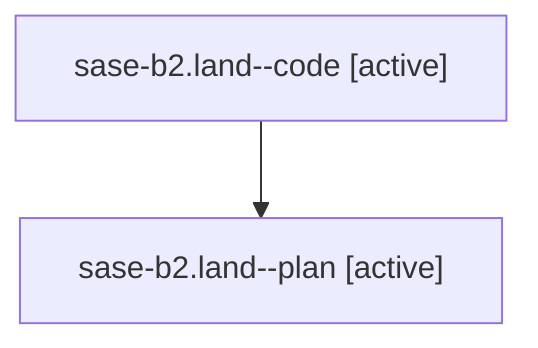

# Family: sase-b2.land

[Agent Hoods](../README.md) / [bbugyi200](../users/bbugyi200/README.md) / [athena](../users/bbugyi200/machines/athena/README.md) / [sase-b2](../users/bbugyi200/machines/athena/hoods/sase-b2/README.md) / sase-b2.land

Owner: `bbugyi200.athena` · Hood: `sase-b2` · Members: 2

## Lineage

The diagram is an optional enhancement; the ordered table below contains the same lineage in accessible text.

| Role | Agent | State | Model / provider | Timing | Commits | Prompt | Chat |
|---|---|---|---|---|---:|---|---|
| code | sase-b2.land--code | active | gpt-5.6-sol / codex | 2026-07-30T03:55:40.186922+00:00 | [1](../agents/bbugyi200.athena.sase-b2.land--code/README.md#commits) | — | — |
| plan | sase-b2.land--plan | active | opus / claude | 2026-07-30T03:44:02.426582+00:00 | 0 | [Prompt](../agents/bbugyi200.athena.sase-b2.land--plan/prompt.md) | [Chat](../agents/bbugyi200.athena.sase-b2.land--plan/chat.md) |

## Commits

| Role | Repo | Commit | Subject | Committed (UTC) |
|---|---|---|---|---|
| code | sase | [`a78894e`](https://github.com/sase-org/sase/commit/a78894e7c409ce576b873af1526570b71d367cce) | fix: resolve artifact entities for workspace projects | 2026-07-30 04:12:07 |

## Neighbors

| Agent | Relation | State |
|---|---|---|
| [sase-b2.1](../agents/bbugyi200.athena.sase-b2.1/README.md) | sase-b2 hood | completed |
| [sase-b2.2](../agents/bbugyi200.athena.sase-b2.2/README.md) | sase-b2 hood | completed |
| [sase-b2.3](../agents/bbugyi200.athena.sase-b2.3/README.md) | sase-b2 hood | completed |
| [sase-b2.4](../agents/bbugyi200.athena.sase-b2.4/README.md) | sase-b2 hood | completed |
| [sase-b2.5](../agents/bbugyi200.athena.sase-b2.5/README.md) | sase-b2 hood | completed |
| [sase-b2.6](../agents/bbugyi200.athena.sase-b2.6/README.md) | sase-b2 hood | completed |
| [sase-b2.7](../agents/bbugyi200.athena.sase-b2.7/README.md) | sase-b2 hood | completed |
| [sase-b2.8](../agents/bbugyi200.athena.sase-b2.8/README.md) | sase-b2 hood | completed |
| [sase-b2.9](../agents/bbugyi200.athena.sase-b2.9/README.md) | sase-b2 hood | completed |
| [sase-b2.9.w0](../agents/bbugyi200.athena.sase-b2.9.w0/README.md) | sase-b2 hood | active |
