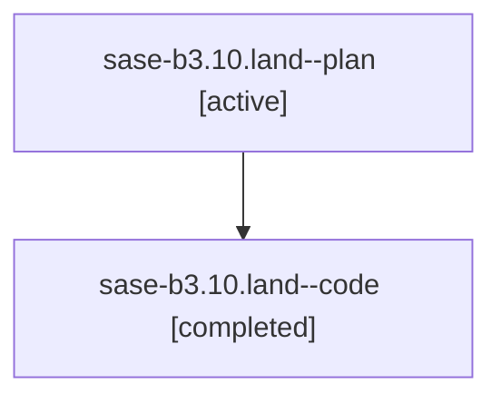

# Family: sase-b3.10.land

[Agent Hoods](../README.md) / [bbugyi200](../users/bbugyi200/README.md) / [athena](../users/bbugyi200/machines/athena/README.md) / [sase-b3](../users/bbugyi200/machines/athena/hoods/sase-b3/README.md) / sase-b3.10.land

Owner: `bbugyi200.athena` · Hood: `sase-b3` · Members: 2 · Bead: [sase-b3.10](https://github.com/sase-org/sase--beads/blob/main/pages/sase-b3/sase-b3.10.md)

## Lineage

The diagram is an optional enhancement; the ordered table below contains the same lineage in accessible text.

| Role | Agent | State | Model / provider | Timing | Commits | Prompt | Chat |
|---|---|---|---|---|---:|---|---|
| plan | sase-b3.10.land--plan | active | gpt-5.6-sol / codex | 2026-07-30T12:03:30.926737+00:00 | 0 | [Prompt](../agents/bbugyi200.athena.sase-b3.10.land--plan/prompt.md) | [Chat](../agents/bbugyi200.athena.sase-b3.10.land--plan/chat.md) |
| code | sase-b3.10.land--code | completed | gpt-5.6-sol / codex | 2026-07-30T12:10:15.395433+00:00 | [1](../agents/bbugyi200.athena.sase-b3.10.land--code/README.md#commits) | — | [Chat](../agents/bbugyi200.athena.sase-b3.10.land--code/chat.md) |

## Commits

| Role | Repo | Commit | Subject | Committed |
|---|---|---|---|---|
| code | sase | [`02de1fd`](https://github.com/sase-org/sase/commit/02de1fd2aceb105419a188fa9cd1d46c53782d7c) | build(deps): require sase-core-rs 0.12.19 | 2026-07-30 08:30:20 EDT |

## Neighbors

| Agent | Relation | State |
|---|---|---|
| [sase-b3.10.1](../agents/bbugyi200.athena.sase-b3.10.1/README.md) | sase-b3.10 hood | active |
| [sase-b3.10.2](../agents/bbugyi200.athena.sase-b3.10.2/README.md) | sase-b3.10 hood | active |
| [sase-b3.10.3](../agents/bbugyi200.athena.sase-b3.10.3/README.md) | sase-b3.10 hood | active |
| [sase-b3.10.4](../agents/bbugyi200.athena.sase-b3.10.4/README.md) | sase-b3.10 hood | active |
| [sase-b3.1](../agents/bbugyi200.athena.sase-b3.1/README.md) | sase-b3 hood | active |
| [sase-b3.2](../agents/bbugyi200.athena.sase-b3.2/README.md) | sase-b3 hood | active |
| [sase-b3.3](../agents/bbugyi200.athena.sase-b3.3/README.md) | sase-b3 hood | active |
| [sase-b3.4](../agents/bbugyi200.athena.sase-b3.4/README.md) | sase-b3 hood | active |
| [sase-b3.5](../agents/bbugyi200.athena.sase-b3.5/README.md) | sase-b3 hood | active |
| [sase-b3.6](../agents/bbugyi200.athena.sase-b3.6/README.md) | sase-b3 hood | active |
| [sase-b3.7](../agents/bbugyi200.athena.sase-b3.7/README.md) | sase-b3 hood | active |
| [sase-b3.8](../agents/bbugyi200.athena.sase-b3.8/README.md) | sase-b3 hood | active |
| [sase-b3.9](../agents/bbugyi200.athena.sase-b3.9/README.md) | sase-b3 hood | active |
| [sase-b3.land](../agents/bbugyi200.athena.sase-b3.land/README.md) | sase-b3 hood | active |
