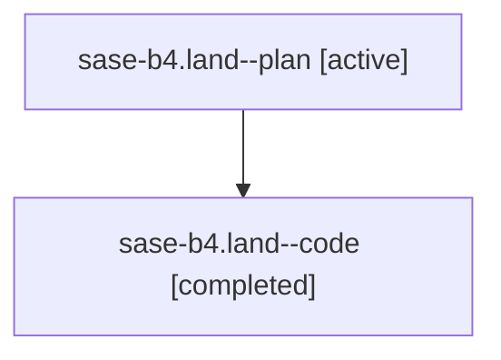

# Family: sase-b4.land

[Agent Hoods](../README.md) / [bbugyi200](../users/bbugyi200/README.md) / [athena](../users/bbugyi200/machines/athena/README.md) / [sase-b4](../users/bbugyi200/machines/athena/hoods/sase-b4/README.md) / sase-b4.land

Owner: `bbugyi200.athena` · Hood: `sase-b4` · Members: 2 · Bead: [sase-b4](https://github.com/sase-org/sase--beads/blob/main/pages/sase-b4/README.md)

## Lineage

The diagram is an optional enhancement; the ordered table below contains the same lineage in accessible text.

| Role | Agent | State | Model / provider | Timing | Commits | Prompt | Chat |
|---|---|---|---|---|---:|---|---|
| plan | sase-b4.land--plan | active | gpt-5.6-sol / codex | 2026-07-30T11:58:42.466278+00:00 | 0 | [Prompt](../agents/bbugyi200.athena.sase-b4.land--plan/prompt.md) | [Chat](../agents/bbugyi200.athena.sase-b4.land--plan/chat.md) |
| code | sase-b4.land--code | completed | gpt-5.6-sol / codex | 2026-07-30T12:12:55.963261+00:00 | [1](../agents/bbugyi200.athena.sase-b4.land--code/README.md#commits) | — | [Chat](../agents/bbugyi200.athena.sase-b4.land--code/chat.md) |

## Commits

| Role | Repo | Commit | Subject | Committed |
|---|---|---|---|---|
| code | sase | [`11cdd78`](https://github.com/sase-org/sase/commit/11cdd7807bc30b10cbb073f1af7bb17060c0bfab) | build(deps): require sase-core-rs 0.12.19 | 2026-07-30 12:32:56 UTC |

## Neighbors

| Agent | Relation | State |
|---|---|---|
| [sase-b4.1](../agents/bbugyi200.athena.sase-b4.1/README.md) | sase-b4 hood | active |
| [sase-b4.2](../agents/bbugyi200.athena.sase-b4.2/README.md) | sase-b4 hood | active |
| [sase-b4.3](../agents/bbugyi200.athena.sase-b4.3/README.md) | sase-b4 hood | active |
