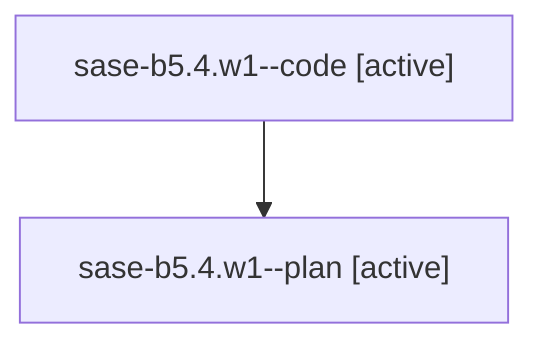

# Family: sase-b5.4.w1

[Agent Hoods](../README.md) / [bbugyi200](../users/bbugyi200/README.md) / [athena](../users/bbugyi200/machines/athena/README.md) / [sase-b5](../users/bbugyi200/machines/athena/hoods/sase-b5/README.md) / sase-b5.4.w1

Owner: `bbugyi200.athena` · Hood: `sase-b5` · Members: 2

## Lineage

The diagram is an optional enhancement; the ordered table below contains the same lineage in accessible text.

| Role | Agent | State | Model / provider | Timing | Commits | Prompt | Chat |
|---|---|---|---|---|---:|---|---|
| code | sase-b5.4.w1--code | active | gpt-5.6-sol / codex | 2026-07-30T13:29:26.715551+00:00 | [1](../agents/bbugyi200.athena.sase-b5.4.w1--code/README.md#commits) | — | — |
| plan | sase-b5.4.w1--plan | active | opus / claude | 2026-07-30T13:14:28.253324+00:00 | 0 | [Prompt](../agents/bbugyi200.athena.sase-b5.4.w1--plan/prompt.md) | [Chat](../agents/bbugyi200.athena.sase-b5.4.w1--plan/chat.md) |

## Commits

| Role | Repo | Commit | Subject | Committed (UTC) |
|---|---|---|---|---|
| code | sase | [`63d0ca5`](https://github.com/sase-org/sase/commit/63d0ca504d48b8daed6702e38d79443d77af44cb) | feat: show repository names in commit tables | 2026-07-30 13:44:26 |

## Neighbors

| Agent | Relation | State |
|---|---|---|
| [sase-b5.4](../agents/bbugyi200.athena.sase-b5.4/README.md) | ancestor | completed |
| [sase-b5.4.w0.w0](../agents/bbugyi200.athena.sase-b5.4.w0.w0/README.md) | sase-b5.4 hood | active |
| [sase-b5.1](../agents/bbugyi200.athena.sase-b5.1/README.md) | sase-b5 hood | completed |
| [sase-b5.2](../agents/bbugyi200.athena.sase-b5.2/README.md) | sase-b5 hood | completed |
| [sase-b5.3](../agents/bbugyi200.athena.sase-b5.3/README.md) | sase-b5 hood | completed |
| [sase-b5.5](../agents/bbugyi200.athena.sase-b5.5/README.md) | sase-b5 hood | completed |
| [sase-b5.land](../agents/bbugyi200.athena.sase-b5.land/README.md) | sase-b5 hood | active |
